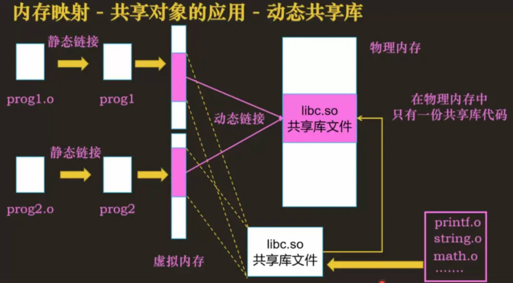

<style>
    p {
        text-indent: 2em; /* 首行缩进2字符 */
    }
</style>
# C++基础

## 变量作用域与存储类型

### 四种变量对比

| 变量类型 | 作用域 | 生命周期 | 默认链接性 | 关键特性 | 程序内存空间 |
|:---|:---|:---|:---|:---|:---|
| **全局变量** | 整个程序（所有源文件） | 程序运行期间 | 外部链接（extern） | 一处定义，多处声明 | 静态储存区 |
| **静态全局变量** | 仅定义它的源文件 | 程序运行期间 | 内部链接（static） | 避免命名冲突 | 同上 |
| **局部变量** | 定义它的函数内部 | 函数执行期间 | 无链接 | 每次调用重新初始化 | 栈 |
| **静态局部变量** | 定义它的函数内部 | 程序运行期间 | 无链接 | **只初始化一次**，值在函数调用间保持 | 静态储存区 |

---

### 详细说明

#### 1. 全局变量

- **作用域**：全局作用域，在一个源文件中定义后，可被**所有其他源文件**访问
- **定义规则**：
  - 只能在一个 `.cpp` 文件中**定义一次**
  - 其他需要使用该变量的源文件必须用 `extern` 关键字**声明**（不是再次定义）
- **⚠️ 常见错误**：
  ```cpp
  // ❌ 错误：在头文件中定义全局变量
  // globals.h
  int g_value = 10;  // 被多个cpp包含 → 重复定义错误
  
  // ✅ 正确做法
  // globals.h
  extern int g_value;  // 声明（不分配内存）
  
  // globals.cpp
  int g_value = 10;    // 定义（仅一次）
    ```

#### 2.静态变量、见下文

## struct（结构体）vs union（联合体）

### 核心区别

| 对比维度 | struct（结构体） | union（联合体） |
|:---|:---|:---|
| **内存分配** | 独立分配，每个成员拥有独立存储空间 | 内存覆盖，所有成员共享同一块内存 |
| **内存大小** | 各成员大小之和（+ 内存对齐填充） | 等于**最大成员**的大小 |
| **成员地址** | 各成员地址不同 | 所有成员**起始地址相同** |
| **成员状态** | 所有成员**同时有效** | 仅**最后一个赋值**的成员有效 |
| **修改影响** | 互不干扰 | 会覆盖其他成员的值 |

### 详细说明

#### 1. struct（结构体）

- **内存分配**：编译器为每个成员分配独立的存储空间
- **地址分布**：各成员的存储地址各不相同
- **对齐规则**：遵循**内存对齐**原则，可能产生填充字节（padding）
- **有效性**：所有成员可同时被访问和修改，互不影响

#### 2. union（联合体）

- **内存分配**：采用**内存覆盖**技术
- **地址分布**：所有成员共享**同一块内存**，起始地址相同
- **大小计算**：联合体总大小 = **最大成员**的大小（+ 对齐调整）
- **有效性**：**同时只有一个成员持有有效值**，修改任一成员会覆盖其他成员的数据

```cpp
typedef union
{
    char c[10];
    double d;
}u8;    // double 8字节，char 1字节，分配16字节空间
cout << sizeof(u8) << endl;     // 16

typedef struct
{
    char c;
    double d;
}u9;    // 1（char）+ 7（内存对齐）+ 8（double）= 16 字节
cout << suzeof(u9) << endl;     // 16

```
# C++ struct vs class 继承

### 1️⃣ 核心规则

在 C++ 中，**继承方式的默认权限取决于派生类的类型**：

| 派生类类型 | 默认继承权限 |
|------------|------------|
| `class`    | `private`  |
| `struct`   | `public`   |

> ⚠️ 注意：基类类型不影响继承权限，只影响其成员默认访问（class=private, struct=public）。

### 关键点

1. **默认继承权限只影响成员访问**：
   - `public` 继承 → 基类的 `public` 成员在派生类中仍是 `public`，`protected` 成员保持 `protected`  
   - `protected` 继承 → 基类的 `public` 和 `protected` 成员在派生类中都变为 `protected`  
   - `private` 继承 → 基类的 `public` 和 `protected` 成员在派生类中都变为 `private`  

2. **基类类型影响成员默认访问**：
   - struct 基类 → 默认成员是 `public`  
   - class 基类 → 默认成员是 `private`  

3. **派生类类型影响继承默认权限**：
   - class 派生 → 默认 `private` 继承  
   - struct 派生 → 默认 `public` 继承  

---

### 2️⃣ 案例分析

### 示例 1：struct vs class

```cpp
struct A { 
public:
    int x; 
protected:
    int y; 
private:
    int z;
};

class B : A {};      // class B 默认private继承
struct C : B {};     // struct C 默认public继承
```
**B内部可以访问A的public和protected成员**
**B的对象访问时：**
    A的public和protected变为B的private
    A的privateB内部无法访问

```cpp
struct A {
public: int pub;
protected: int prot;
private: int priv;
};

class B : private A {
public:
    void test() {
        pub = 1;    // ✔ 可以访问
        prot = 2;   // ✔ 可以访问
        // priv = 3; // ❌ 不可以访问
    }
};

struct C : B {
    void test2() {
        // pub = 1;  ❌ 该对象已经成为B的私有成员，
        // C只能访问B的public和protected成员，
        // 不能访问 B 私有成员
    }
};
```
# C++  static静态成员变量
### static作用于局部变量
改变局部变量生存周期，令其存在于定义之后，直到程序运行结束
```cpp
#include <iostream>
using namespace std;

int fun(){
    static int var = 1;
    var++;
    return var;
}
int main()
{
    for(int i = 0; i < 10; ++i)
    	cout << fun() << " "; // 2 3 4 5 6 7 8 9 10 11
    return 0;
}
```

**static作用于全局变量和函数**
改变全局变量和函数的作用于，使其只能在定义它的文件中使用（局部可见）
普通全局变量和函数具有全局可见性（其他源文件也可以使用）

**static作用于类成员变量和类成员函数**
使得类变量和类成员函数能够不定义类的对象便能访问静态成员
类的静态成员函数中只能访问静态成员变量或者静态成员函数，不能将静态成员函数定义成虚函数。

**静态成员变量使用说明**
  - 类内声明、类外定义和初始化
  - 定义和初始化时不要出现static关键字和private、public、protected
  - 静态成员变量相当于类作用域中的全局变量，被其所有对象共享，包括派生类对象
  - 静态成员变量可以作为成员函数的参数，普通成员变量不行(例1)
  - 静态数据成员的类型可以是所属类的类型，而普通数据成员的类型只能是**该类类型的指针或引用**（例2
```cpp
#include <iostream>
using namespace std;

// 例1
class A
{
public:
    static int s_var;
    int var;
    // 正确，静态成员变量可以作为成员函数的参数
    void fun1(int i = s_var); 
    // error: invalid use of non-static 
    void fun2(int i = var);   
    data member 'A::var'
};
int main()
{
    return 0;
}

/**
    例2
*/
class A
{
public:
    static A s_var; // 正确，静态数据成员
    A var;          // error: field 'var' has incomplete type 'A'
    A *p;           // 正确，指针
    A &var1;        // 正确，引用
};
```

| 对比维度 | 说明 | 使用场景 | 生命周期 |
|:---|:---|:---|:---|
| **全局静态变量** | 限制变量仅在当前文件内可见 | 多个文件需要独立使用同名变量 | 整个程序运行期间 |
| **局部静态变量** | 在函数第一次调用时变量被初始化，之后保留值 | 记录调用次数、单例模式中确保全局仅有一个实例 | 同上 |
| **类静态成员变量** | 于整个类而非某个对象，所有对象共享该变量，需要在类外单独初始化 | 统计类的实例数量（构造函数中total++、析构函数中total-- | 同上 |

```cpp
// 1. 全局静态变量
static int file_scope_only = 10;  // 只在当前 .cpp 文件可见

// 2. 局部静态变量
void func() {
    static int count = 0;         // 函数结束时不会销毁，下次调用保留值
    count++;
}

// 3. 类静态成员
class MyClass {
    static int class_var;         // 所有对象共享
};
int MyClass::class_var = 0;
```

虽然函数体内定义了一个静态局部变量，函数体外仍然可以定义一个同名变量，因为该静态局部变量的作用于仅限定义它的函数体`{}`内部

```cpp
#include <iostream>

int value = 100;  // 全局变量

void testFunc() {
    static int value = 0;  // 静态局部变量，和全局变量同名
    value++;
    std::cout << "函数内的静态局部变量 value: " << value << std::endl;
}

int main() {
    std::cout << "全局变量 value: " << value << std::endl;
    
    testFunc();  // 输出 1
    testFunc();  // 输出 2
    testFunc();  // 输出 3
    
    std::cout << "全局变量 value 仍然是: " << value << std::endl;  // 还是 100
    
    return 0;
}
```

输出结果
```txt
全局变量 value: 100
函数内的静态局部变量 value: 1
函数内的静态局部变量 value: 2
函数内的静态局部变量 value: 3
全局变量 value 仍然是: 100
```

---

## 数据结构核心知识笔记

本部分整理了常用数据结构的特点、核心操作时间复杂度及典型应用场景，方便快速查阅与对比。

---

### 一、线性结构

### 1. 数组 (Array)
- **存储**：连续内存，支持随机访问。
- **操作复杂度**：
  - 访问（下标）：O(1)
  - 末尾插入/删除：O(1)（均摊）
  - 中间插入/删除：O(n)
  - 查找（无序）：O(n)；有序时可用二分 O(log n)
- **典型用途**：缓存、查找表、矩阵、动态规划基础。

### 2. 链表 (Linked List)
- **存储**：动态内存，非连续，通过指针链接。
- **操作复杂度**：
  - 按索引访问：O(n)
  - 已知位置插入/删除：O(1)
  - 查找：O(n)
- **变体**：单向链表、双向链表、循环链表。
- **典型用途**：LRU 缓存底层、栈/队列实现、大对象动态管理。

### 3. 栈 (Stack)
- **特点**：后进先出（LIFO）。
- **操作复杂度**：压入、弹出、取顶 O(1)。
- **典型用途**：函数调用栈、括号匹配、表达式求值、深度优先搜索（DFS）。

### 4. 队列 (Queue)
- **特点**：先进先出（FIFO）。
- **操作复杂度**：入队、出队、取队首 O(1)。
- **典型用途**：任务调度、消息队列、广度优先搜索（BFS）。

---

### 二、哈希表 (Hash Table)
- **核心**：通过哈希函数将键映射到存储位置。
- **操作复杂度**：平均 O(1) 插入、删除、查找；最坏 O(n)（哈希冲突严重）。
- **典型用途**：缓存、字典、计数器、集合去重、LRU 缓存辅助结构。

---

### 三、树形结构

### 1. 二叉搜索树 (BST)
- **性质**：左子树 < 根 < 右子树。
- **操作复杂度**：平均 O(log n)，最坏 O(n)（退化为链表）。
- **典型用途**：动态有序集合、符号表。

### 2. 平衡二叉搜索树（AVL、红黑树）
- **特点**：通过旋转保持树高 O(log n)。
- **操作复杂度**：插入、删除、查找 O(log n)。
- **典型用途**：C++ `std::map` / `std::set` 底层，要求最坏情况性能的场景。

### 3. 堆 (Heap)
- **特点**：完全二叉树，分为最大堆（根最大）和最小堆（根最小）。
- **操作复杂度**：
  - 取最值（堆顶）：O(1)
  - 插入、删除堆顶：O(log n)
  - 建堆：O(n)
- **典型用途**：优先队列、堆排序、Top K、Dijkstra 算法、合并 K 个有序链表。

### 4. 线段树 / 树状数组 (Segment Tree / Fenwick Tree)
- **特点**：高效处理区间查询与单点更新。
- **操作复杂度**：O(log n)
- **典型用途**：区间求和、区间最值、动态前缀和、逆序对计数。

### 5. Trie（前缀树）
- **特点**：字符串公共前缀共享节点。
- **操作复杂度**：插入、查找 O(L)，L 为字符串长度。
- **典型用途**：自动补全、单词查找、拼写检查、IP 路由表。

---

### 四、图结构 (Graph)
- **表示方式**：邻接矩阵（O(1) 边查询，空间 O(V²)）、邻接表（空间 O(V+E)）。
- **常用算法复杂度**：
  - 遍历（DFS/BFS）：O(V+E)
  - 最短路径：Dijkstra O((V+E) log V)（使用堆），Floyd O(V³)
- **典型用途**：网络拓扑、社交关系、路径规划、推荐系统。

---

### 五、特殊结构

### 1. 并查集 (Disjoint Set Union / Union-Find)
- **特点**：高效维护集合合并与查询。
- **操作复杂度**：近乎 O(α(n))（反阿克曼函数，近似常数）。
- **典型用途**：连通分量、最小生成树（Kruskal）、动态连通性、朋友圈问题。

### 2. 跳表 (Skip List)
- **特点**：多层链表，实现有序集合。
- **操作复杂度**：插入、删除、查找 O(log n)（概率平衡）。
- **典型用途**：Redis 有序集合（zset）底层实现。

### 3. 布隆过滤器 (Bloom Filter)
- **特点**：概率型数据结构，用于判断元素**可能**在集合中（有假阳性，无假阴性）。
- **操作复杂度**：插入、查询 O(k)，k 为哈希函数个数，空间高效。
- **典型用途**：缓存穿透防御、黑名单过滤、网页爬虫去重。

---

### 六、LRU 缓存设计要点

LRU（最近最少使用）缓存通常由**哈希表 + 双向链表**实现：
- 哈希表：`key → 链表节点指针`，O(1) 查找。
- 双向链表：存储 `(key, value)`，头部为最近使用，尾部为最久未使用。
- **操作复杂度**：get / put 均为 O(1)。
- **关键设计**：链表节点中必须保存 `key`，以便淘汰时从哈希表中删除对应条目。

---

### 七、数据结构选择速查表

| 需求 | 推荐结构 | 关键复杂度 |
|------|----------|------------|
| 快速随机访问 | 数组 | O(1) 访问 |
| 频繁中间插入/删除 | 链表 | O(1) 已知位置 |
| 后进先出 | 栈 | O(1) 压入/弹出 |
| 先进先出 | 队列 | O(1) 入队/出队 |
| 键值快速查找 | 哈希表 | O(1) 平均 |
| 有序数据动态维护 | 平衡 BST / 跳表 | O(log n) |
| 取最值 + 动态更新 | 堆 | O(log n) 插入/删除根 |
| 区间查询 + 单点更新 | 树状数组 / 线段树 | O(log n) |
| 字符串前缀匹配 | Trie | O(L) |
| 集合连通性 | 并查集 | O(α(n)) |
| 概率存在性判断 | 布隆过滤器 | O(k) 空间高效 |

---

*注：实际性能受具体实现、数据分布、内存访问模式等因素影响，表中为理论平均/最坏情况。*

## C/C++ 中 `#define` 与 `const` 对比分析

| 对比维度 | `#define`（宏定义） | `const`（常量限定符） |
| :--- | :--- | :--- |
| **编译阶段** | **预处理阶段**进行文本替换<br>• 宏展开发生在编译之前<br>• 不参与词法分析、语法分析、类型检查<br>• 预处理后宏名消失，替换为对应的值或表达式 | **编译阶段**进行处理<br>• 被视为变量，分配符号表或内存空间<br>• 参与语法分析、语义分析<br>• 经历类型检查和作用域规则 |
| **安全性** | **类型不安全**<br>• 无类型检查，仅做机械的文本替换<br>• 容易引发副作用（如宏参数多次求值问题）<br>• 运算符优先级易出问题，需加括号<br>• 调试困难，宏展开后难以追踪 | **类型安全**<br>• 编译器进行严格的类型检查<br>• 赋值、运算时进行类型兼容性验证<br>• 作用域规则清晰（块级、函数级、文件级）<br>• 编译器可进行常量折叠等优化 |
| **内存占用** | **不占用数据段内存**<br>• 预处理后宏名消失，直接替换为字面量<br>• 字面量可能存储在代码段或常量区<br>• 多次使用同一宏会产生多份字面量拷贝（可能增加代码体积） | **可能占用内存**<br>• 对于全局 const：通常存储在只读数据段（.rodata）<br>• 对于局部 const：可能分配在栈上<br>• 编译器优化时可能完全优化掉（如同宏一样内联）<br>• 取 const 变量地址时必须分配内存 |
| **调试** | **调试困难**<br>• 符号表中不存在宏名<br>• 断点无法打在宏上<br>• 宏展开后代码行号信息混乱<br>• gdb 等调试器无法直接打印宏的值 | **调试友好**<br>• 符号表中存在 const 变量名<br>• 可设置断点、单步跟踪<br>• 调试器可直接显示变量的值<br>• 支持在 watch 窗口中查看 |
| **其他差异** | • 可定义带参数的“函数式宏”<br>• 可跨多行（使用 `\` 续行）<br>• 可进行条件编译（`#ifdef` 等）<br>• 不受作用域限制（直到 `#undef`） | • 不能定义函数形式的常量<br>• 遵循 C++ 作用域规则<br>• 可与 `extern` 联合使用<br>• C++11 起支持 `constexpr`（编译期常量） |
| **C++ 建议** | **尽量用 `const`（或 `constexpr`）替代 `#define`**<br>• Scott Meyers 《Effective C++》：<br>  **“宁以编译器替换预处理器”** | **推荐使用**<br>• 类型安全、易于调试<br>• 作用域可控<br>• 更适合现代 C++ 编程风格 |

## 典型错误示例对比

### `#define` 常见问题

```cpp
#define SQUARE(x) x * x
int a = SQUARE(1+2);   // 展开为 1+2 * 1+2 = 5，预期 9

#define DOUBLE(x) (x) + (x)
int b = 3 * DOUBLE(2); // 展开为 3 * (2) + (2) = 8，预期 12
```

## `#define` 与 `typedef` 区别整理（C/C++）

## 一、核心区别

- `#define`
	- 预处理器进行的文本替换
	- 不属于真正的 C++ 类型系统

- `typedef`
	- 为已有类型创建“别名”
	- 属于编译器类型系统的一部分

---

# 二、基础对比表

| 对比项 | `#define` | `typedef` |
|---|---|---|
| 本质 | 文本替换 | 类型别名 |
| 处理阶段 | 预处理阶段 | 编译阶段 |
| 是否类型安全 | ❌ 否 | ✅ 是 |
| 是否参与编译器类型检查 | ❌ 不参与 | ✅ 参与 |
| 调试时是否可见 | ❌ 不可见 | ✅ 可见 |
| 推荐程度 | ⚠️ 少用于类型定义 | ✅ 推荐 |
| 现代替代 | `constexpr` / `inline` | `using` |

---

# 三、基本示例

## 1、`#define`

```cpp
#define INT int

INT a = 10;
// 相当于 int a = 10;本质为纯文本替换
```
使用'#define'编译器不会管INT是什么类型，只替代相应文本

```cpp
typedef int INT;

INT a = 10;
// INT是int的别名
```
使用'typedef'编译器会执行类型检查、推导，调试分析等

## **指针定义区别**
```cpp
#define PTR int*
typedef int* PTR2

PTR a, b;
PTR2 c, d;
/**
* 实际等价于
* int* a;
* int b;
* int* c;
* int* d;
* '#define'实现的是文本替换，而typedef实现的是完成类型
```

## 现代Cpp使用using
推荐使用
```cpp
using INT = int;
// 等价于 typedef int INT;
```
现代C++趋势是使用`using`替代`typedef`；`constexpr/inline/template`替代大量`#define`

```cpp
// ❌ typedef：语法怪异，难以理解
typedef void (*FuncPtr)(int, double);
typedef std::map<std::string, std::vector<int>> MyMap;

// 定义模板别名？typedef 做不到，需要用包装类
template<typename T>
struct MyAlloc {
    typedef std::vector<T, MyAllocator<T>> type;
};
MyAlloc<int>::type v;  // 使用起来很繁琐
```

---
```cpp
// ✅ using：直观，像普通变量赋值一样
using FuncPtr = void(*)(int, double);
using MyMap = std::map<std::string, std::vector<int>>;

// ✅ using 可以直接定义模板别名
template<typename T>
using MyVector = std::vector<T, MyAllocator<T>>;

MyVector<int> v;  // 使用简洁，像普通模板一样
```

`#define` 是文本替换，没有类型检查，不遵守作用域，调试困难
`constexpr`类型安全、作用域可控、可调试
```cpp
// ❌ #define：没有类型，不检查作用域
#define PI 3.14159
#define MAX_BUFFER 1024
#define SQUARE(x) ((x)*(x))

int main() {
    double area = PI * r * r;      // PI 没有类型，调试时看不到符号
    #undef PI                      // 可以在任意位置取消定义，危险
    
    int arr[MAX_BUFFER];           // 如果 MAX_BUFFER 被意外重定义，行为不可预测
    
    int result = SQUARE(a + b);    // 宏容易出错，需要加很多括号
}
```
---
```cpp
// ✅ constexpr：有类型，有作用域，可调试
constexpr double PI = 3.14159;
constexpr int MAX_BUFFER = 1024;

// constexpr 函数也可以编译时计算
constexpr int square(int x) {
    return x * x;
}

int main() {
    double area = PI * r * r;      // PI 是真正的变量，调试器可见
    int arr[MAX_BUFFER];           // 编译时常量，安全
    
    // 在局部作用域定义
    constexpr int LOCAL_MAX = 100; // 只在当前作用域有效
    
    int result = square(a + b);    // 普通函数调用，没有宏的陷阱
}
```

C++17之前，跨文件共享常量麻烦
```cpp
// ❌ 传统方式：需要在 .h 声明，在 .cpp 定义
// constants.h
extern const int GLOBAL_VALUE;
```
---
```cpp
// constants.cpp
const int GLOBAL_VALUE = 42;
```
---
```cpp
// 如果只想用宏，但没有类型安全
#define GLOBAL_VALUE 42
```
---
`inline`变量可以单文件定义，跨文件使用
```cpp
// ✅ 直接在一个头文件中定义即可
// constants.h
inline constexpr int GLOBAL_VALUE = 42;  // inline + constexpr 完美组合

// 其他任何文件包含这个头文件，使用的都是同一个变量
```

## volatile关键字
当对象值可能在程序的控制或检测之外被改变时，应该将该对象声明为 violatile，告知编译器不用归该对象进行优化。

volatile不具备原子性。使用该关键字后，编译器不会对相应的对象进行优化，即不会将变量从内存缓存到寄存器中，防止多个线程有可能使用内存中的变量，有可能使用寄存器中的变量，从而导致程序错误。
**原子性：**
```
    不可分割的最小操作单位。具备原子性的操作不会被中断，只有完成和不开始两种状态。
    **补充说明**
    **数据库事物特性：**
    Atomicity 原子性
    Consistency 一致性
    Isolation 隔离性
    Durability 持久性
```

## 虚函数

使用virtual进行修饰的成员函数

virtual告知编译器，这个函数可能会被子类重写

虚函数允许通过积累指针或引用，在运行时调用派生类重写后的函数，从而实现动态多态，以此统一接口和操作

**动态多态**

也叫动态绑定，作用是让同一段代码，在运行时根据对象真实类型表现出不同的行为。

| 类型 | 静态多态 | 动态多态 | 
| :-- | :--| :-- |
| **决定时机** | 编译时 | 运行时 |
| **典型例子** | 函数重载、模板 | 虚函数 |

### 动态多态举例
``` cpp
class Animal {
public:
	virtual void speak() {
		cout << "Animal speak\n";
	}
};

class Dog : public Animal {
public:
	void speak() override {
		cout << "Dog bark\n";
	}
};

class Cat : public Animal {
public:
	void speak() override {
		cout << "Cat meow\n";
	}
};

Animal* p1 = new Dog;
Animal* p2 = new Cat;

p1->speak();    // 输出 Dog bark
p2->speak();    // 输出 Cat meow
```

### 静态多态举例
```cpp
// 编译时知道需要调用哪个
void print(int x);
void print(double x);
```
---
### **析构函数**
一般将析构函数设置为虚函数，解决基类指针指向派生类对象时资源释放问题（详见上方cpp代码例子）

假使我们有一个积累指针，指向一个派生类对象

删除这个指针时，如果析构函数不是虚函数，那么**编译器实施静态绑定**，删除基类指针时就只会调用基类的析构函数，而不会调用派生类的析构函数，导致资源没有正确释放

将析构函数设为虚函数，删除基类指针时，会先调用派生类析构函数，再调用基类析构函数

```cpp
class Base {
public:
	~Base() {
		cout << "Base destructor\n";
	}
};

class Derived : public Base {
public:
	~Derived() {
		cout << "Derived destructor\n";
	}
};

Base* p = new Derived;
delete p;           // 输出 Base destructor， Derived资源没有释放
```

在上例中，delete p操作中的p是Base*， 由于析构函数不是虚函数，只会调用 Base::~Base()。导致资源释放不彻底

```cpp
class Base {
public:
	virtual ~Base() {
		cout << "Base destructor\n";
	}
};

class Derived : public Base {
public:
	~Derived() {
		cout << "Derived destructor\n";
	}
};

Base* p = new Derived;
delete p;           
/**
* 输出
* Derived destructor
* Base destructor
*/
```

**构造函数为什么不写作虚函数**

-空间角度
  - 虚函数对应一个vtable，此vtable存储在对象的内存空间中，如果构造函数是虚函数，需要通过vtable调用。
  - 可此时对象没有实例化，无法找到vtable
- 使用角度
  - 虚函数使得通过父类指针或引用调用它时，能够根据子类调用相应成员函数
  - 构造函数在创建对象时自动调用，不能通过父类指针或者引用调用

## 内联函数
在C++ 中，使用**inline**声明一个内联函数。内联函数在编译时被视作候选项，编译器会尝试将其展开，将函数体直接插入到调用点处。这样可以避免函数调用的开销。

---
### `#define` 与 `inline` 区别整理（C/C++）

---

### 一、核心一句话

- `#define`
	- 预处理器进行的文本替换
	- 不是真正函数

- `inline`
	- 编译器支持的内联函数
	- 是真正函数

---

### 二、最核心区别 ⭐

| 对比项 | `#define` | `inline` |
|---|---|---|
| 本质 | 文本替换 | 真正函数 |
| 处理阶段 | 预处理阶段 | 编译阶段 |
| 是否类型检查 | ❌ 没有 | ✅ 有 |
| 是否安全 | ⚠️ 容易出错 | ✅ 更安全 |
| 是否支持作用域 | ❌ 不支持 | ✅ 支持 |
| 是否可调试 | ❌ 不易调试 | ✅ 可调试 |
| 推荐程度 | ⚠️ 少用 | ✅ 推荐 |

---

### 三、最经典例子：求最大值

- 宏定义

```cpp
#define MAX(a,b) ((a)>(b)?(a):(b))
int x = MAX(3, 5);
// 预处理后等价于 int x = ((3)>(5)?(3):(5));
// 风险示例
int i = 1;
int x = MAX(i++, 5);
// 预处理后展开为 ((i++) > (5) ? (i++) : (5))；
// 可能导致 i++ 执行多次造成结果混乱
```
```cpp
// inline函数
inline int Max(int a, int b)
{
	return a > b ? a : b;
}
int x = Max(i++, 5);
// 此处参数只计算一次
```
---
### `inline` 与普通函数调用 区别整理（C/C++）

---

### 一、核心一句话

- 普通函数：
	- 调用时需要发生函数跳转
	- 存在函数调用开销

- `inline` 函数：
	- 编译器可能直接将函数代码展开
	- 减少函数调用开销

---

### 二、最核心区别 ⭐

| 对比项 | 普通函数 | inline函数 |
|---|---|---|
| 是否是真正函数 | ✅ 是 | ✅ 是 |
| 是否类型安全 | ✅ 是 | ✅ 是 |
| 是否有函数调用开销 | ✅ 有 | ⚠️ 可能没有 |
| 是否一定展开 | ❌ 不展开 | ❌ 不一定展开 |
| 编译器处理方式 | 正常调用 | 尝试内联展开 |
| 适合场景 | 普通逻辑 | 小型、高频、简单逻辑函数 |

---

### 三、普通函数调用过程

- 示例

```cpp
int add(int a, int b)
{
	return a + b;
}

int main()
{
	int x = add(1, 2);
}
```
在普通函数调用时，CPU需要进行
- 保存当前现场
- 参数压栈
- 跳转到函数位置
- 执行函数
- 返回调用位置
- 恢复现场
即**函数调用开销**

如果使用inline函数
```cpp
inline int add(int a, int b)
{
	return a + b;
}

int main()
{
	int x = add(1,2);
}
// 编译器可以将其优化为
// int x = 1 + 2;
// 大大减少调用开支
```

**inline 只是建议展开，而非一定展开**
当遇到以下情况可以继续使用普通函数调用
- 函数太大
- 有递归
- 有复杂循环
- 优化策略不适合

---
### 内联函数缺点

- **代码膨胀**
  - 如果内联函数体非常大或者被频繁调用，会增加可执行文件的大小，可能导致缓存不命中迎新
- **编译时间增加**
  - 内联函数在每个调用点进行代码替换，这会增加编译时间
- **降低可读性**
  - 函数体不集中，可能导致难以维护
---
### include<文件名> && #include "文件名"

- 查找文件位置
  - include <文件名>在标准库头文件所在目录中查找，如果没有再在当前目录下查找
  - #include "文件名"在当前源文件所在目录中查找，如果没有再到系统目录中查找
- 使用习惯
  - 前者标准库；后者自己定义的头文件
---

### void*
**无类型指针**，可以用于表示指向任何类型的指针
它不能直接进行解引用，不能进行指针运算。需要转换为具体指针类型才能进行操作

常用于在不同类型之间进行通用操作的情况
比如在函数中传递任意类型的指针参数或者在动态内存分配中使用

使用步骤：
1. 存地址
2. 强制转换回真实类型
3. 再解引用
   
```cpp
int a = 10;

void* p = &a;

cout << *(int*)p << endl;
```
现在更多使用模板template<typename T>来替代void*

**模板**是 C++ 实现泛型编程的核心工具。它的本质是：让代码在编译时根据你提供的类型“自动生成”不同版本的函数或类，从而避免为每种数据类型重复写相似的代码。

---
*函数模板*

```cpp
// 求最大值函数
int Max(int a, int b)
{
	return a > b ? a : b;
}
double Max(double a, double b)
{
	return a > b ? a : b;
}
string Max(string a, string b)
{
	return a > b ? a : b;
}
```
```cpp
// 使用模板防止代码重复
template<typename T>
T Max(T a, T b)
{
	return a > b ? a : b;
}
cout << Max(3,5); // 编译器自动推导T=int
```
```cpp
// 多模板参数
template<typename T1, typename T2>
class Pair {
public:
	T1 first;
	T2 second;
};
Pair<int,string> p;
```
---
*类模板*

```cpp
template <typename T>
class Box {
private:
    T content;
public:
    void set(const T& item) {
        content = item;
    }
    T get() const {
        return content;
    }
};

int main() {
    Box<int> intBox;   // 实例化一个装 int 的 Box 类
    intBox.set(123);
    std::cout << intBox.get() << std::endl; // 输出 123

    Box<std::string> strBox; // 实例化一个装 string 的 Box 类
    strBox.set("Hello Templates");
    std::cout << strBox.get() << std::endl; // 输出 Hello Templates

    return 0;
}
```
---
*模板特化*

有时，对于某些特定的数据类型，通用模板的逻辑并不适用。比如，你写了一个通用的排序模板，但对于 const char* 类型，你想用特殊的字符串比较逻辑。这时，你可以为特定类型提供一个“特化版本”。

```cpp
#include <iostream>
#include <cstring>

template <typename T>
T max(T a, T b) {
    std::cout << "通用版本: ";
    return (a > b) ? a : b;
}

// 为 const char* 类型提供特化版本
template <>
const char* max<const char*>(const char* a, const char* b) {
    std::cout << "const char* 特化版本: ";
    return (strcmp(a, b) > 0) ? a : b;
}

int main() {
    int x = 10, y = 20;
    std::cout << max(x, y) << std::endl; // 调用通用版本

    const char* s1 = "hello";
    const char* s2 = "world";
    std::cout << max(s1, s2) << std::endl; // 调用 const char* 特化版本
    return 0;
}
```
---

**模板补充**、

- 每个独立的模板类都需要声明一次 `template <typename T>`
```cpp
// ✅ 第一个模板类
template <typename T>
class Box {
    T content;
};

// ✅ 第二个模板类（需要重新声明）
template <typename T>
class Wrapper {
    T data;
};

// ❌ 错误：不能共用一次声明
template <typename T>
class Box { ... };
class Wrapper { ... };  // 这个 Wrapper 不是模板类！
```

- 在一个模板类内部定义多个成员函数时，不需要重复写 `template <typename T>`
```cpp
template <typename T>
class Box {
public:
    void set(const T& item);   // 只是声明，不需要 template
    T get() const;              // 只是声明，不需要 template
};

// 类外定义成员函数时才需要再次写 template <typename T>
template <typename T>
void Box<T>::set(const T& item) { ... }

template <typename T>
T Box<T>::get() const { ... }
```

- 使用特化模板时，需要明确写出具体的类型
```cpp
// 通用模板
template <typename T>
T max(T a, T b) {
    return (a > b) ? a : b;
}

// 特化版本：明确写出类型是 const char*
template <>                    // 空模板参数列表
const char* max<const char*>(const char* a, const char* b) {
    //  ↑ 这里明确写出了返回类型
    return (strcmp(a, b) > 0) ? a : b;
}
```

上例中，`max<const char*>`用于说明这里是一个特殊模板。可以省略，编译器按照上文`template<>`自动推导，不过不建议

template <> 告诉编译器"这是一个特化版本"

max<const char*> 明确指定这个特化是针对 const char* 类型的

返回类型 const char* 也必须明确写出

---
### sizeof && strlen
```cpp
#include <iostream>
#include <cstring>

using namespace std;

void size_of(char arr[])
{
    cout << sizeof(arr) << endl; // warning: 'sizeof' on array function parameter 'arr' will return size of 'char*' .
    cout << strlen(arr) << endl; 
}

int main()
{
    char arr[20] = "hello";
    size_of(arr); 
    return 0;
}
/*
输出结果：
8
5
*/
```
对arr进行sizeof操作时，发生**数组退化**（即warning所说内容），实际传入的是一个指针，因此64位系统得到的 "sizeof(*arr)" 结果为8

```cpp
template<size_t N>
void func(char (&arr)[N])
{
    cout << sizeof(arr) << endl;
}
char arr[20];
// 此时运行结果为20
func(arr);
```

在上例中，arr作为C风格数组
- 会退化
- 无.size()方法
- 无成员函数

如果是std::array：
- 不会退化
- 有.size()方法(成员函数)
- STL容器

---

STL容器本质是**class**,穿参时传递的是**对象**，而非**数组首地址**

```cpp
void func(char arr[]);
// 等价于下式
void func(char* arr);
// 数组传参会退化
```

```cpp
#include <array>

void func(array<int, 20> arr)
{
    // std::array是类对象，不是原生数组，不会发生退化
    cout << arr.size();
}
// 形如下式，会在调用时复制整个数组，不推荐
void func(vector<int> v)；
// 一般使用：
void func(const vector<int>& v);
void func(const array<int,20>& arr);
// 不拷贝、不退化、可以使用.size()
```

### explicit

用于声明类构造函数是显式调用而非隐式调用。可以阻止调用构造函数时进行隐式转换。只可用于修饰单参构造函数，因为无参构造函数和多参构造函数本身就是显示调用的，使用 explicit 关键字也没有什么意义

```cpp
// 隐式转换场景
#include <iostream>
using namespace std;

class A {
public:
    int var;
    A(int tmp) {
        var = tmp;
    }
};

int main() {
    A ex = 10; // 发生了隐式转换
    return 0;
}
```

A ex = 10; 在编译时，进行了隐式转换，将 10 转换成 A 类型的对象，然后将该对象赋值给 ex

```cpp
// 使用explicit关键字声明
#include <iostream>
using namespace std;

class A {
public:
    int var;
    explicit A(int tmp) {
        var = tmp;
        cout << var << endl;
    }
};

int main() {
    A ex(100);
    A ex1 = 10; // error: conversion from 'int' to non-scalar type 'A' requested
    return 0;
}
```

### memcpy函数
直接操作内存块的二进制数据。它从源地址开始，逐个字节（或按更高效的块）复制数据到目标地址，直到复制完指定的字节数。整个过程不关心数据类型，纯粹按字节搬运，所以复制后目标内存和源内存的二进制内容完全一致，但不会处理像字符串结束符这类特殊情况。

通过std::memcpy或直接memcpy进行调用(需要 `#include <cstring>`).
**void *memcpy(void *dst, const void *src, size_t size)**

```cpp
#include <cstring>
memcpy(dst, src, size);
// 等价于：for(i=0; i<size; i++) dst[i] = src[i];
// 完全不检查 src 中是否有 '\0'

// 情况一,size大于src有效长度
char src[5] = "abc";  // 实际内容: 'a','b','c','\0'，长度4
char dst[10];
memcpy(dst, src, 10);  // ❌ 错误！读 src[4]...src[9]
// 读取超出边界，产生未定义行为

// 情况二,size小于src长度，截断
char src[] = "hello world";
char dst[20];
memcpy(dst, src, 5);  // 只复制 "hello"
dst[5] = '\0';        // 必须手动加结束符！
printf("%s", dst);    // 输出 "hello"（否则会乱码）
```

处理字符串方法，感觉没啥用
| 函数 | 行为 | 安全性 |
| :-- | :-- | :-- |
| memcpy(dest, sec, n) | 精确复制N字节，不关心\0 | 可能需要手动管理边界 |
| strcpy(dest, src) | 复制直到\0,包括\0 | 可能溢出 |
| strncpy(dest, stc, n) | 最多N字节，不足补\0,超出不补 | 可能遗漏\0 |
| strlen(str) | 只计算有效字符，不包含\0 | |
| sizeof(str) （数组） | 计算整个数组大小，包含\0 | | 

```cpp
char str[] = "hello";     // 数组版本
memcpy(buf, str, sizeof(str));  // ✅ 可以，sizeof(str)=6
```
```cpp
char *str = "hello";      // 指针版本  
memcpy(buf, str, sizeof(str));          // ❌ 错误！sizeof(str)=8（指针大小）
memcpy(buf, str, strlen(str) + 1);      // ✅ 正确
memcpy(buf, str, sizeof(str));          // ❌ 复制 8 字节 → 灾难！
```

### C风格和STL容器

```cpp
// C风格
char* str1 = new char[10];
strcpy(str1, "hello");
char* str2 = new char[20];
strcpy(str2, str1);
strcat(str2, " world");  // 必须保证空间足够
delete[] str1;
delete[] str2;            // 容易忘记释放
```

```cpp
// STL容器，安全简洁
std::string str1 = "hello";
std::string str2 = str1;        // 自动拷贝
str2 += " world";                // 自动扩容
// 无需手动释放
```

| 方面 | C风格字符串 char* | STL容器 std::string |
| :-- | :--| :-- |
| 内存管理 | 手动new/delete或静态数组 | 自动管理，RAII原则 |
| 边界安全 | 容易越界、缓冲区溢出 | 自动扩容、边界检查 |
| 拷贝、赋值 | 手动strcpy/memcpy | 支持'='直接估值 |
|字符串拼接 | strcat，容易出错 | +或+=，安全直观 |
|获取长度 | O(n)遍历（strlen） | O(1)返回（.size()） |
|空值安全 | 野指针、空指针崩溃 | 存在明确状态（空字符串） |
|算法配合 | 不直接支持 | 支持STL算法 |
`std::string`不使用 `strlen` 和 `sizeof`，而是用 `.size()` 或 `.length()` 方法来获取字符串长度。`\0`不参与`std::string`的长度计算

# C++编译

C++的编译过程经过了预处理、编译、汇编和链接四个主要阶段

- **预处理**
    对源代码进行处理，主要包括展开宏定义、处理条件编译指令（如#include、#define、#ifdef等）以及删除注释等。预处理的结果是生成一个经过宏展开和条件处理后的纯C++源代码文件。
- **编译**
    将预处理后的源代码翻译为汇编语言，生成汇编代码。编译器会进行词法分析、语法分析和语义分析，检查代码的正确性，并生成中间代码表示。
- **汇编**
    将汇编代码转换为机器可以执行的目标文件。汇编器会将汇编代码转化为机器指令，并生成与机器硬件平台相关的目标文件（通常以".obj"或".o"为扩展名）
- **链接**
    将目标文件与其他必要的库文件链接在一起，生成可执行程序。链接器会解析目标文件中的符号引用，将其与其他目标文件或库文件中的符号定义进行匹配，最终生成一个完整的可执行文件。在链接阶段，还会进行地址重定位、符号解析、符号表生成等操作，确保程序的正确执
- 装载 - 运行
    程序运行时由操作系统装载到内存并从入口函数开始执行

### 静态链接库、动态链接库
- **连接方式** 
    静态链接库在编译链接时会被完整地复制到可执行文件中，成为可执行文件的一部分；而动态链接库在编译链接时只会在可执行文件中包含对库的引用，实际的库文件在运行时由操作系统动态加载。
- **文件大小**
    静态链接库代码被完整幅值到可执行文件中，使文件大小增加；
    动态链接库不增加可执行文件大小，库的代码只有在运行时才会加载
- **内存占用**
    静态链接库在运行时会被完整地加载到内存中，占用固定的内存空间；
    动态链接库在运行时才会被加载，可以在多个进程之间共享，减少内存占用。
- **可拓展性**
    动态链接库的可扩展性更好，可以在不修改可执行文件的情况下替换或添加新的库文件；
    静态链接库需要重新编译链接。

---

| 特性 | 静态链接库 | 动态链接库 |
|:---|:---|:---|
| **文件后缀** | Windows: `.lib`<br>Linux: `.a` | Windows: `.dll`<br>Linux: `.so`<br>macOS: `.dylib` |
| **链接时机** | 编译链接阶段，代码被复制进最终程序 | 运行时加载 |
| **最终产物** | 一个独立的大体积可执行文件 | 小体积可执行文件 + 若干依赖库 |
| **内存占用** | 高（多程序重复拷贝） | 低（多程序共享内存） |
| **库更新** | 需重新编译整个程序 | 只需替换库文件 |

---

**静态库**
1. 有一个静态库文件 `MathLib.lib`,其中包含了add函数
2. 编译主程序main.exe时，链接器将add函数机械码拷贝到main.exe中
3. 把这个 `main.exe` 发给其他设备，直接能运行。缺点是文件体积大，如果 add 函数发现算错了，需要重新编译整个 main.exe 发发送。
```cpp
// main.cpp
#include <iostream>
// 假设静态库里就是这个函数,位于MathLib.lib中而非main函数中
// int add(int a, int b) { return a + b; }

int main() {
    std::cout << add(3, 5) << std::endl;
    // 此时的 add 代码已经完整躺在 main.exe 里了
    return 0;
}
```

**动态库**
1. 编译一个 MathLib.dll 文件（动态库），里面也有 add 函数。
2. 编译主程序 main.exe 时，链接器不复制代码，而是记录一个标记：“我要用 MathLib.dll 里的 add 函数”
3. 运行 main.exe 时，Windows 系统会做两件事：
   - 在 main.exe 所在目录查找 MathLib.dll；
   - 如果找到了，就把 MathLib.dll 加载进内存，把 add 函数的地址告诉 main.exe，然后程序开始执行。
4. 发程序时，必须同时给 main.exe 和 MathLib.dll 两个文件（或者让程序从网上下载）。但如果 add 函数升级了，你可以只发一个新的 MathLib.dll 给他，main.exe 不用动。

```cpp
// main.cpp
#include <iostream>
// 只是声明有这个函数，但不提供实现（实现在 dll 里）
extern "C" __declspec(dllimport) int add(int a, int b);

int main() {
    std::cout << add(3, 5) << std::endl;
    // 此时 main.exe 不知道 add 的机器码，只知道“去 MathLib.dll 里找”
    return 0;
}
```

# 面向对象的C++

**面向对象：** 对象是指具体的某一个事物，这些事物的抽象就是类，类中包含数据（成员变量）和动作（成员方法）
- **封装**
    - 将具体的实现过程和数据封装成一个函数，只能通过接口进行访问，降低耦合性
- **继承**
    - 子类继承父类的特征和行为，子类有父类的非 `private` 方法或成员变量，子类可以对父类的方法进行重写，增强了类之间的耦合性
    - 但是当父类中的成员变量、成员函数或者类本身被 `final` 关键字修饰时，修饰的类不能继承，修饰的成员不能重写或修改
- **多态**
    - 不同继承类的对象，对同一消息做出不同的响应，基类的指针指向或绑定到派生类的对象，使得基类指针呈现不同的表现方式

### C++ 特性介绍

**封装**是将一些数据和函数封装到类中，这样外层调用类只会调用到设计者想让他调用的方法

**继承**通常是设计一个基类，然后分别设置子类去继承基类的一些方法，尤其是虚函数，针对不同子类的特点对虚函数进行重写

**公有继承**是将基类的成员都原封不动的继承下来，**私有继承**则会将其改为私有部分

**多态**是有函数重载和之前提到的虚函数，函数重载是可以使得相同的函数面对不同的参数个数或者类型进行不同的方式实现

### 如何理解C++是面向对象编程
```
结合项目经历展开解释，举例子，对比面向过程编程
```

**面向过程编程**

一种以执行程序操作的过程或函数为中心编写软件的方法。

程序的数据通常存储在变量中，与这些过程是分开的。所以必须将变量传递给需要使用它们的函数。

缺点：随着程序变得越来越复杂，程序数据与运行代码的分离可能会导致问题。例如，程序的规范经常会发生变化，从而需要更改数据的格式或数据结构的设计。当数据结构发生变化时，对数据进行操作的代码也必须更改为接受新的格式。查找需要更改的所有代码会为程序员带来额外的工作，并增加了使代码出现错误的机会

**面向对象编程**

以创建和使用对象为中心。

一个对象（Object）就是一个软件实体，它将数据和程序在一个单元中组合起来。对象的数据项，也称为其属性，存储在成员变量中。对象执行的过程被称为其成员函数。将对象的数据和过程绑定在一起则被称为封装。

| 维度 | 面向过程 | 面向对象 |
| :-- | :-- | :-- |
| 关注点 | 步骤实现 | 参与对象 |
| 组织单位 | 函数 | 对象(类) |
| 数据处理 | 分离（数据传给函数） | 绑定（对象具备自己的方法）|
| 代码复用 | 函数复用 | 继承+多态+封装 |
| 简单表述 | 以函数为中心，数据作为参数在函数间传递 | 以对象为中心，将数据和行为封装在一起，通过对象间的协作解决问题 |

面向过程：数据是被动的 
```c
// 数据是个结构体，本身"不会动"
struct Student {
    char name[50];
    int score;
};

// 函数在外面"操作"数据
void printScore(Student* s) {
    printf("%s: %d", s->name, s->score);
}
```

```c
// 数据和处理分离
double calculateArea(double radius) {
    return 3.14159 * radius * radius;
}

int main() {
    double r = 5.0;
    printf("面积: %f", calculateArea(r));
}
```

面向对象：数据主动
```cpp
class Student {
private:
    string name;
    int score;
public:
    void printScore() {  // 对象自己知道怎么打印
        cout << name << ": " << score;
    }
};
// 调用时：student.printScore();  // 对象自己做事
```

```cpp
// 数据和方法绑定在一起
class Circle {
private:
    double radius;
public:
    Circle(double r) : radius(r) {}
    double getArea() {  // 圆自己知道怎么算面积
        return 3.14159 * radius * radius;
    }
};

int main() {
    Circle c(5.0);
    cout << "面积: " << c.getArea();
}
```

### 重写、重载、隐藏

**重载** 根据参数列表确定调用哪个函数，不关心函数返回类型

```cpp
class A {
public:
    void fun(int tmp);
    void fun(float tmp);        // 重载 参数类型不同（相对于上一个函数）
    void fun(int tmp, float tmp1); // 重载 参数个数不同（相对于上一个函数）
    void fun(float tmp, int tmp1); // 重载 参数顺序不同（相对于上一个函数）
    int fun(int tmp);            // error: 'int A::fun(int)' cannot be overloaded 错误：注意重载不关心函数返回类型
};
```

**重写（覆盖）** 派生类中重新定义的函数

函数名、参数列表、返回值类型都必须同基类中被重写的函数一致，只有函数体不同。派生类调用时会调用派生类的重写函数，不会调用被重写函数。重写的基类中被重写的函数必须有 virtual 修饰。

```cpp
#include <iostream>
using namespace std;

class Base {
public:
    virtual void fun(int tmp) {
        cout << "Base::fun(int tmp) : " << tmp << endl;
    }
};

class Derived : public Base {
public:
    virtual void fun(int tmp) {
        cout << "Derived::fun(int tmp) : " << tmp << endl;
    } // 重写基类中的 fun 函数
};

int main() {
    Base *p = new Derived();
    p->fun(3); // Derived::fun(int) : 3
    return 0;
}
```

**隐藏** 派生类的函数屏蔽了与其同名的基类函数，只要是同名函数，不管参数列表是否相同，基类函数都会被隐藏

```cpp
#include <iostream>
using namespace std;

class Base {
public:
    void fun(int tmp, float tmp1) {
        cout << "Base::fun(int tmp, float tmp1)" << endl;
    }
};

class Derive : public Base {
public:
    void fun(int tmp) {
        cout << "Derive::fun(int tmp)" << endl;
    } // 隐藏基类中的同名函数
};

int main() {
    Derive ex;
    ex.fun(1);       // Derive::fun(int tmp)
    ex.fun(1, 0.01); // error: candidate expects 1 argument, 2 provided
    return 0;
}
```

上述代码中 ex.fun(1, 0.01); 出现错误，说明派生类中将基类的同名函数隐藏了。若是想调用基类中的同名函数，可以加上类型名指明 ex.Base::fun(1, 0.01);，这样就可以调用基类中的同名函数

**只要子类定义了同名函数（无论参数是否相同），就会隐藏父类的所有同名函数，与是否为虚函数无关**

| 特性 | 重写 | 隐藏 |
| :-- | :-- | :-- |
| 函数签名 | 必须完全相同 | 可以不同（同名即可） |
| 是否需要virtual | 基类需要声明virutal | 不需要 | 
| 多态行为 | 支持（父类指针调用子类版本） | 不支持 |
| 作用域 | 子类替换父类实现 | 子类屏蔽父类**所有**同名函数 |

```cpp
class Base {
public:
    virtual void foo(int x) { }      // 虚函数
    void bar(int x) { }              // 非虚函数
    void bar(double x) { }           // 重载
};

class Derived : public Base {
public:
    // 重写：签名相同 + 基类 virtual
    virtual void foo(int x) override { }  // ✅ 重写
    
    // 隐藏：同名即隐藏（不管参数）
    void bar(int x) { }                   // 隐藏了 Base 中的所有 bar
    // 结果：Base::bar(double) 也被隐藏了！
};
```

想要调用被隐藏的父类函数，可以使用作用域解析符`::`
```cpp
int main() {
    Derive ex;
    
    ex.fun(1);                    // 调用子类版本
    ex.Base::fun(1, 0.01);        // ✅ 显式调用父类版本
    ex.Base::fun(1);              // ✅ 如果父类有这个重载版本
    
    return 0;
}
```

使用`using`避免隐藏

```cpp 
class Derive : public Base {
public:
    using Base::fun;  // 把 Base 中的所有 fun 引入当前作用域
    void fun(int tmp) { }  // 现在不会隐藏，而是重载
};

int main() {
    Derive ex;
    ex.fun(1);           // ✅ 调用子类版本
    ex.fun(1, 0.01);     // ✅ 调用父类版本（因为 using 引入了）
}
```

---

| 特性 | 重写 (Override) | 重载 (Overload) | 隐藏 (Hide) |
|------|----------------|----------------|-------------|
| **发生范围** | 基类与派生类之间 | **同一类**内部 | 基类与派生类之间 |
| **函数名** | **相同** | **相同** | **相同** |
| **参数列表** | **必须相同** | **必须不同**（类型/个数/顺序） | **可以相同或不同** |
| **返回类型** | 相同或协变（子类指针/引用） | 可以不同 | 可以不同 |
| **virtual 要求** | **基类必须加 `virtual`** | 不需要 | 不需要 |
| **作用域** | 不同类（父子关系） | 同一个类 | 不同类（父子关系） |
| **编译时/运行时** | **运行时**决定（动态绑定） | **编译时**决定（静态绑定） | **编译时**决定（静态绑定） |
| **典型用途** | 实现多态，子类替换父类行为 | 提供同一操作的不同参数版本 | 子类屏蔽父类接口（应尽量避免） |

---

### **编译时多态、运行时多态**

- **编译时多态** 主要通过函数重载和模板实现
    编译器在编译时，就能算出要调用的具体是哪个函数，直接把地址写死在代码里
    
**函数重载**

```cpp
class Calculator {
public:
    int add(int a, int b) { return a + b; }        // 整数加法
    double add(double a, double b) { return a + b; } // 浮点数加法
};

int main() {
    Calculator calc;
    // 编译器在编译这行时就知道：参数是整数，所以调用 int add(int,int)
    cout << calc.add(3, 5);     
    // 编译器在编译这行时就知道：参数是浮点数，所以调用 double add(double,double)
    cout << calc.add(3.14, 2.86); 
}
```

在编译出的代码里，对 add 的调用已经变成了两个不同的函数地址。就好像代码里直接写了 add_int_int 和 add_double_double

**模板**

```cpp
template <typename T>
T max(T a, T b) {
    return a > b ? a : b;
}

int main() {
    // 编译器看到这，会生成一个 int 版本的 max 函数，然后调用它
    cout << max(3, 5);    
    // 编译器看到这，会生成一个 double 版本的 max 函数，然后调用它
    cout << max(3.14, 2.86);
}
```
- **运行时多态** 主要通过虚函数和继承实现

代码在运行时，根据对象的实际类型决定调用哪个函数

```cpp
class Animal {
public:
    // 加了 virtual，就是虚函数了
    virtual void speak() { cout << "动物叫" << endl; }
};

class Dog : public Animal {
public:
    void speak() override { cout << "汪汪" << endl; }
};

class Cat : public Animal {
public:
    void speak() override { cout << "喵喵" << endl; }
};

// 一个通用的函数，它不关心你传进来的是 Dog 还是 Cat
void letAnimalSpeak(Animal *animal) {
    animal->speak(); // 关键在这一行：编译时不知道会调用谁
}

int main() {
    Dog dog;
    Cat cat;

    letAnimalSpeak(&dog); // 运行时，发现 animal 实际指向 Dog，所以调用 Dog::speak
    letAnimalSpeak(&cat); // 运行时，发现 animal 实际指向 Cat，所以调用 Cat::speak
}
```

### 函数对象

函数对象是指一个重载了 operator() 的类或结构体实例。函数对象可以像普通函数一样被调用，但它们实际上是对象，具有状态和行为。`operator` 关键字用于重载运算符

```cpp
class Vector {
public:
    int x, y;
    Vector(int x, int y) : x(x), y(y) {}

    // 重载 + 运算符
    Vector operator+(const Vector& other) const {
        return Vector(this->x + other.x, this->y + other.y);
    }
};

int main() {
    Vector v1(1, 2), v2(3, 4);
    Vector v3 = v1 + v2; // 优雅，直观！
    // 上面这行等价于: v1.operator+(v2);
    return 0;
}
```

一个类如果重载了`()`，则它的实例可以像函数一样被调用

```cpp
#include <iostream>

// 1. 定义一个类，并重载 operator()
class Adder {
public:
    // operator() 可以接收参数并返回值
    int operator()(int a, int b) const {
        return a + b;
    }
};

int main() {
    // 2. 创建这个类的实例（对象）
    Adder myAdder;

    // 3. 像使用函数一样使用这个对象
    int result = myAdder(3, 5); 
    // 上面这行等价于: myAdder.operator()(3, 5);

    std::cout << result << std::endl; // 输出 8
    return 0;
}
```

在上例中，const修饰成员函数本省，承诺该成员函数不会修改任何成员变量

```cpp
class Counter {
private:
    int count = 0;  // 成员变量
public:
    // ❌ 错误：const 函数不能修改成员变量
    void increment() const {
        count++;  // 编译错误！不能修改 count
    }
    
    // ✅ 正确：非 const 函数可以修改
    void increment() {
        count++;
    }
    
    // ✅ 正确：const 函数只能读取，不能修改
    int getCount() const {
        return count;  // 允许读取
    }
};
```

| `const`位置 | 修饰对象 | 示例 |
| :-- | :-- | :-- |
| 函数参数 | 参数本身不能修改 | `void func(const int x)` |
| 函数返回值 | 返回值为`const` | `const int func()` |
| 函数末尾 | 成员对象不可修改 | `void func() const` |
|成员变量 | 成员变量初始化后无法修改 | `const int maxsize = 100` |

# 类

class中缺省[构造函数、析构函数、拷贝构造函数、赋值运算符重载函数]，如果一个类没有显式定义它们，则编译器会自动生成这些函数

### 纯虚函数

纯虚函数是在基类中声明的虚函数，且没有在积累中定义。它要求任何派生类都定义自己的实现方法，声明形式如下：

```cpp
virtual void funtion() = 0;
```

其中` = 0 `为纯虚函数标识。含有纯虚函数的类被称作**抽象类**，抽象类无法被实例化，只能作为接口使用。

派生类必须实现所有的纯虚函数，否则该派生类也会变成抽象类。

纯虚函数应用场景 

- 设计模式：例如在模板方法模式中，基类定义一个算法的骨架，而将一些步骤延迟到子类中实现。这些需要在子类中实现的步骤就可以声明为纯虚函数。
- 接口定义：可以创建一个只包含纯虚函数的抽象类作为接口。所有实现该接口的类都必须提供这些函数的实现。

**虚函数和纯虚函数**

- 虚函数可以直接使用，纯虚函数需要再派生类中实现后使用
- 虚函数定义时在普通函数基础上加上`virtual`关键字；纯虚函数还需要再末尾加上` = 0`
- 虚函数必须实现，不然编译器报错
- 对于**实现纯虚函数**的派生类，纯虚函数在该类中被称为虚函数，虚函数和纯虚函数均可再派生类中重写

```cpp
#include <iostream>
using namespace std;

class A
{
public:
    virtual void v_fun() // 虚函数
    {
        cout << "A::v_fun()" << endl;
    }
};
class B : public A
{
public:
    void v_fun()
    {
        cout << "B::v_fun()" << endl;
    }
};
int main()
{
    A *p = new B();
    p->v_fun(); // B::v_fun()
    return 0;
}
```
| 误区 | 纠错 |
| :-- | :-- |
| "抽象类不能有任何实现" | ❌ 抽象类可以有普通函数和 `/n`已实现的虚函数 |
| "抽象类所有函数都是纯虚的" | ❌ 只需要至少一个纯虚函数 |
| "抽象类不能有构造函数" | ❌ 抽象类可以有构造函数（用于子类初始化） |
| "抽象类不能有成员变量" | ❌ 抽象类可以有成员变量 |

抽象类完整示例如下 

```cpp 
#include <iostream>
using namespace std;

class Shape {
private:
    string color;  // ✅ 可以有成员变量
    
public:
    // 构造函数（抽象类可以有构造函数）
    Shape(const string& c) : color(c) {}
    
    // 纯虚函数
    virtual double getArea() const = 0;
    
    // 普通函数（已实现）
    string getColor() const {
        return color;
    }
    
    // 虚函数（已实现，子类可选择是否重写）
    virtual void display() const {
        cout << "This is a shape" << endl;
    }
    
    // 虚析构函数（重要！）
    virtual ~Shape() {}
};

// 子类必须实现纯虚函数
class Circle : public Shape {
private:
    double radius;
    
public:
    Circle(const string& c, double r) : Shape(c), radius(r) {}
    
    // 必须实现 getArea
    double getArea() const override {
        return 3.14159 * radius * radius;
    }
    
    // 可以重写 display（可选）
    void display() const override {
        cout << "This is a circle" << endl;
    }
};

int main() {
    // Shape s;  // ❌ 错误：不能实例化抽象类
    
    Circle c("red", 5.0);
    cout << "Color: " << c.getColor() << endl;    // ✅ 继承自抽象类
    cout << "Area: " << c.getArea() << endl;      // ✅ 子类实现
    c.display();                                   // ✅ 子类重写
    
    // 多态使用
    Shape* ptr = new Circle("blue", 3.0);
    cout << ptr->getArea() << endl;  // 调用 Circle 的版本
    delete ptr;
    
    return 0;
}
```

### virtual的传染性

一旦某个函数在继承体系的任意一个上层被声明为 virtual，它向下传递时永远保持虚函数特性，无论中间派生类是否写了 virtual 关键字

```cpp
#include <iostream>
using namespace std;

class Grand {
public:
    virtual void func() {  // 祖父类声明为 virtual
        cout << "Grand::func" << endl;
    }
};

class Parent : public Grand {
public:
    // 注意：这里没有写 virtual
    void func() override {  // 但仍然是虚函数
        cout << "Parent::func" << endl;
    }
};

class Child : public Parent {
public:
    // 注意：这里也没有写 virtual
    void func() override {  // 仍然是虚函数
        cout << "Child::func" << endl;
    }
};

int main() {
    Grand* p;
    
    p = new Parent();
    p->func();  // 输出：Parent::func（多态生效）
    
    p = new Child();
    p->func();  // 输出：Child::func（多态生效）
    
    return 0;
}
```

### override关键字

C++11引入，建议在派生类中使用override

```cpp
class Base {
public:
    virtual void func() { }
};

class Derived : public Base {
public:
    void func(int x) { }  // 不小心写错了参数，本想重写但变成了一个新函数
};

int main() {
    Base* p = new Derived();
    p->func();   // 调用的是 Base::func，不是 Derived 的！
    // 因为没有成功重写，多态失效了
}

// 使用override情况
// class Derived : public Base {
// public:
//     void func(int x) override { }  // ❌ 编译错误！
//     // 错误：Derived::func(int) 并没有重写 Base::func()
// };
```
override只是检查关键字，每个派生类需要单独重写override

| 特性 |	virtual	| override |
| :-- | :-- | :-- |
| 作用	| 声明函数为虚函数 | 检查是否成功重写 |
| 是否必需 |	基类中必需，派生类可选可选，但强烈推荐 | 
| 是否传递	| ✅ 自动向下传递 | ❌ 每个派生类需要单独写 | 
| 编译检查	| 无（只是声明） | 有（检查是否真的重写） | 
| 影响多态	| 是（开启多态） | 否（只是检查） |

virtual的使用和override不冲突，使用override定义的派生类依旧是相同签名的函数，使用override不会丢失virtual的传递性

丢失虚函数特性的唯一可能：派生类定义了一个**不同签名**的同名函数，那是一个新函数，不是重写
```cpp
class Base {
public:
    virtual void func(int x) { }  // 参数为 int
};

class Derived : public Base {
public:
    void func(double x) { }  // 参数为 double → 这是新函数，不是重写
};

int main() {
    Base* p = new Derived();
    p->func(3);     // 调用 Base::func(int)，Derived 的版本没被调用
    // 因为参数类型不同，没有重写
}
```

### 虚函数实现机制

虚函数通过虚函数表来实现。虚函数的地址保存在虚函数表中，在类的对象所在的内存空间中，保存了指向虚函数表的指针（称为“虚表指针”），通过虚表指针可以找到类对应的虚函数表。虚函数表解决了基类和派生类的继承问题和类中成员函数的覆盖问题，当用基类的指针来操作一个派生类的时候，这张虚函数表就指明了实际应该调用的函数

**虚函数表**和**类**绑定，**虚表指针**和**对象**绑定。即类的不同的对象的虚函数表是一样的，但是每个对象都有自己的虚表指针，来指向类的虚函数表

- 虚函数表存放内容：类的虚函数地址
- 虚函数表建立时间：编译阶段，程序编译过程中会将虚函数地址放到虚函数表中
- 虚表指针存放位置：对象内存空间中最前位置，确保正确取到虚函数偏移量

编译器处理虚函数表
- 编译器将虚函数表的指针放在类的实例对象的内存空间中，该对象调用该类的虚函数时，通过指针找到虚函数表，根据虚函数表中存放的虚函数的地址找到对应的虚函数。
- 如果派生类没有重新定义基类的虚函数 A，则派生类的虚函数表中保存的是基类的虚函数 A 的地址，也就是说基类和派生类的虚函数 A 的地址是一样的。
- 如果派生类重写了基类的某个虚函数 B，则派生的虚函数表中保存的是重写后的虚函数 B 的地址，也就是说虚函数 B 有两个版本，分别存放在基类和派生类的虚函数表中。
- 如果派生类重新定义了新的虚函数 C，派生类的虚函数表保存新的虚函数 C 的地址。

**单继承无虚函数覆盖**：
```cpp
#include <iostream>
using namespace std;

class Base
{
public:
    virtual void B_fun1() { cout << "Base::B_fun1()" << endl; }
    virtual void B_fun2() { cout << "Base::B_fun2()" << endl; }
    virtual void B_fun3() { cout << "Base::B_fun3()" << endl; }
};

class Derive : public Base
{
public:
    virtual void D_fun1() { cout << "Derive::D_fun1()" << endl; }
    virtual void D_fun2() { cout << "Derive::D_fun2()" << endl; }
    virtual void D_fun3() { cout << "Derive::D_fun3()" << endl; }
};
int main()
{
    Base *p = new Derive();
    p->B_fun1(); // Base::B_fun1()
    return 0;
}
```

基类对象对应虚函数表存放：`Base::B_fun1()` `Base::B_fun2()` `Base::B_fun3()`
派生类对象对应虚函数表存放：`Base::B_fun1()` `Base::B_fun2()` `Base::B_fun3()` `Derive::D_fun1()` `Derive::D_fun2()` `Derive::D_fun3()`

**单继承有虚函数覆盖**

```cpp
#include <iostream>
using namespace std;

class Base
{
public:
    virtual void fun1() { cout << "Base::fun1()" << endl; }
    virtual void B_fun2() { cout << "Base::B_fun2()" << endl; }
    virtual void B_fun3() { cout << "Base::B_fun3()" << endl; }
};

class Derive : public Base
{
public:
    virtual void fun1() { cout << "Derive::fun1()" << endl; }
    virtual void D_fun2() { cout << "Derive::D_fun2()" << endl; }
    virtual void D_fun3() { cout << "Derive::D_fun3()" << endl; }
};
int main()
{
    Base *p = new Derive();
    p->fun1(); // Derive::fun1()
    return 0;
}
```

派生类对象对应虚函数表存放：`Base::B_fun2()` `Base::B_fun3()` `Derive::fun1()` `Derive::D_fun2()` `Derive::D_fun3()`

**多继承无虚函数覆盖**

```cpp
#include <iostream>
using namespace std;

class Base1
{
public:
    virtual void B1_fun1() { cout << "Base1::B1_fun1()" << endl; }
    virtual void B1_fun2() { cout << "Base1::B1_fun2()" << endl; }
    virtual void B1_fun3() { cout << "Base1::B1_fun3()" << endl; }
};
class Base2
{
public:
    virtual void B2_fun1() { cout << "Base2::B2_fun1()" << endl; }
    virtual void B2_fun2() { cout << "Base2::B2_fun2()" << endl; }
    virtual void B2_fun3() { cout << "Base2::B2_fun3()" << endl; }
};
class Base3
{
public:
    virtual void B3_fun1() { cout << "Base3::B3_fun1()" << endl; }
    virtual void B3_fun2() { cout << "Base3::B3_fun2()" << endl; }
    virtual void B3_fun3() { cout << "Base3::B3_fun3()" << endl; }
};

class Derive : public Base1, public Base2, public Base3
{
public:
    virtual void D_fun1() { cout << "Derive::D_fun1()" << endl; }
    virtual void D_fun2() { cout << "Derive::D_fun2()" << endl; }
    virtual void D_fun3() { cout << "Derive::D_fun3()" << endl; }
};

int main(){
    Base1 *p = new Derive();
    p->B1_fun1(); // Base1::B1_fun1()
    return 0;
}
```

派生类虚函数表中，使用三个内存块存放虚函数表，基类的顺序和生命顺序一致
- 虚函数表`Base1`存放:`Base1::B1_fun1()` `Base1::B1_fun2()` `Base1::B1_fun3()` `Derive::D_fun1()` `Derive::D_fun2()` `Derive::D_fun3()`
- 虚函数表`Base2`存放：`Base2::B2_fun1()` `Base2::B2_fun2()` `Base2::B2_fun3()`
- 虚函数表`Base3`存放：`Base3::B3_fun1()` `Base3::B2_fun2()` `Base3::B3_fun3()`

多继承有虚函数覆盖参考单继承

**C++空类大小：** 1字节。C++ 规定，任何对象都必须有一个唯一的内存地址。如果空类大小为 0，那么当创建这个类的多个对象时，它们会共享同一个地址，这违反了 “每个对象地址唯一” 的规则

```cpp
class A {};
int main(){
  cout<<sizeof(A)<<endl;// 输出 1;
  A a; 
  cout<<sizeof(a)<<endl;// 输出 1;
  return 0;
}
```

含有虚函数的类对象里都会被编译器隐式插入一个虚函数表指针（教学上常记为 __vptr，但它不是 C++ 标准规定的名字，只是主流编译器的内部实现约定）。它的大小等于平台上的指针大小：32 位机器上是 4 字节，64 位机器上是 8 字节

```cpp
class A { virtual Fun(){} };
int main(){
  cout<<sizeof(A)<<endl;// 输出 4(32位机器)/8(64位机器);
  A a; 
  cout<<sizeof(a)<<endl;// 输出 4(32位机器)/8(64位机器);
  return 0;
}
```

静态成员存放在静态存储区，不占用类的大小, 普通函数也不占用类内大小，它们存放在代码段
对象本身存放在栈、堆或静态存储区
┌─────────────────────────────────┐ 高地址
│           栈 (Stack)            │ ← 局部变量、函数调用帧
├─────────────────────────────────┤
│            堆 (Heap)            │ ← 动态分配（new/malloc）
├─────────────────────────────────┤
│      静态存储区 (Data Segment)   │ ← 全局变量、静态成员、静态局部变量
│   ├─ 已初始化数据 (.data)         │
│   └─ 未初始化数据 (.bss)          │
├─────────────────────────────────┤
│      代码段 (Code/Text Segment) │ ← 所有函数的机器码（普通函数、成员函数、静态函数）
└─────────────────────────────────┘ 低地址

在64位系统中，指针占用8字节，`int`类型为了保持兼容、效率，依然使用32位，即4字节。
类的大小考虑其非静态成员变量的大小之和（考虑内存对齐），和系统位宽没有直接关系

# C++语言特性

### 左值右值

| 引用名称 | 性质 | 持久性 | 示例 | 作用 |
| :-- | :-- | :-- | :-- | :-- |
| 左值 | 持久对象 | 表达式结束依旧存在 | `int& rx = x;` | 可以取地址、作为函数返回值 |
| 右值 | 临时对象 | 表达式结束不再存在 | `int&& rr = 10;` | 不可取地址、作为函数返回值 | 

左值引用**不能**绑定到要转换的表达式、字面常量或返回右值的表达式。右值引用恰好相反，可以绑定到这类表达式，但不能绑定到一个左值上

```cpp
// 要转换的表达式：通过各种类型转换（如 static_cast）产生的临时值
float pi = 3.14f;
// static_cast<int>(pi) 这个操作会产生一个临时的整型值
int&& r5 = static_cast<int>(pi); // ✅ 正确：转换的结果是一个临时整数值（右值）
int&  r6 = static_cast<int>(pi); // ❌ 错误：左值引用不能绑定到这个临时值

// 字面常量
int&& r1 = 10;  // ✅ 正确：10是一个字面常量（右值）
int&  r2 = 10;  // ❌ 错误：左值引用不能绑定到字面常量

// 返回右值的表达式：函数返回临时对象或者简单算术表达式
int getVal() { return 5; }

int&& r3 = getVal(); // ✅ 正确：getVal()返回的是临时值（右值）
int&  r4 = getVal(); // ❌ 错误：左值引用不能绑定到临时值
```

**绑定和幅赋值**
```cpp
void func(int& ref) {
    ref = 100;  // 这是赋值：把 100 这个值放到 ref 引用的变量中
}

int main() {
    int x = 10;
    func(x);     // 绑定：ref 绑定到 x, 即`int& ref = x;`
    // 函数体内 ref = 100 等价于 x = 100
}
```

右值引用必须绑定到右值的引用，通过 && 获得。右值引用只能绑定到一个将要销毁的对象上，因此可以自由地移动其资源

`std::move`**:将左值转换为右值**

```cpp
int main() {
    MyString a("hello");
    MyString b = std::move(a);  // 调用移动构造函数
    // 此时 a 处于"有效但未指定"的状态，通常 data 为 nullptr
    // 可以给 a 赋新值，但不能直接使用其内容
    cout << a.length();         // ❌ 危险！a 可能已被掏空
    return 0;
}
```

### 移动语义

将一个对象持有的资源（比如堆上分配的内存）转移给另一个对象，而不是进行深拷贝

```cpp
class MyString {
private:
    char* data;  // 指向堆上的字符串
    size_t len;
    
public:
    // 拷贝构造函数：深拷贝
    MyString(const MyString& other) {
        len = other.len;
        data = new char[len + 1];   // 末尾记得加个空间放`/0`
        strcpy(data, other.data);   // 复制所有字符
    }
    
    // 析构函数
    ~MyString() {
        delete[] data;
    }
};

MyString createString() {
    MyString temp("hello");
    return temp;  // 返回时会发生拷贝吗？
}

int main() {
    MyString s = createString();  // 可能发生多次拷贝
    return 0;
}
```

上述代码可能发生多次深拷贝，每次都需要分配内存、复制数据，效率很低

对于即将销毁的临时对象（右值），我们不需要深拷贝，只需要把它的资源指针直接拿过来，然后**把原对象的指针置空**（让它不再拥有资源）

```text
// 传统拷贝：完整复制
源对象: [堆内存 A] → 复制 → 目标对象: [堆内存 B]

// 移动语义：只转移指针
源对象: [堆内存 A] → 转移 → 目标对象: [堆内存 A]
源对象: [空指针]
```

```cpp
class MyString {
private:
    char* data;
    size_t len;
    
public:
    // 移动构造函数
    MyString(MyString&& other) noexcept 
        : data(other.data), len(other.len) {
        // 把源对象的指针置空，防止它析构时释放资源
        other.data = nullptr;
        other.len = 0;
    }
    
    // 拷贝构造函数（仍然需要）
    MyString(const MyString& other) {
        len = other.len;
        data = new char[len + 1];
        strcpy(data, other.data);
    }
    
    // 移动赋值运算符
    MyString& operator=(MyString&& other) noexcept {
        if (this != &other) {
            delete[] data;           // 释放当前资源
            data = other.data;       // 转移资源
            len = other.len;
            other.data = nullptr;    // 源对象置空
            other.len = 0;
        }
        return *this;
    }
    
    ~MyString() {
        delete[] data;
    }
};
```
**移动赋值运算符解惑**

1. `&other`能得到什么
```cpp
MyString& operator=(MyString&& other) noexcept {
    if (this != &other) {  // &other 是什么？
    // ...
    }
}
```
获取`other`引用对象的内存地址
```cpp
int a = 10;
int& ref = a;    // ref 是 a 的引用
int* ptr = &a;   // ptr 是指针

// 取地址操作
&a;    // 得到 a 的地址
&ref;  // 也是得到 a 的地址（不是 ref 自己的地址）
&ptr;  // 得到 ptr 这个指针变量本身的地址
```
本例中一些表达式含义
| 表达式 | 含义 |
| :-- | :-- |
| `other` | 右值引用，引用某个`MyString`对象 |
| `&other` | 被引用的`MyString`对象地址 |
| `this` | 指向当前对象(`*this`)内存地址的指针 |
| `*this` | 当前对象 |
`this`为指针，对其解引用得到`this`所指对象，即内存中的当前实体。逻辑上`*this`是当前对象

对一个指针解引用，得到的结果是一个引用，因此`*this`的类型为`Mystring&`


2. `.`和`->`
**相关语法规则**

| 类型 | 示例 | 访问成员 | 说明 |
| :-- | :-- | :-- | :-- |
| 对象 | `MyString obj` | `obj.data` | 使用`.`访问 |
| 引用 | `MyString& ref = obj` | `ref.data` | 同上 |
| 指针 | `MyString* ptr = &obj` | `ptr->data`或`(*ptr).data` | 使用`->` |
3. 返回类型
如上所述

补充说明：

```cpp
MyString a, b, c;
a = b = c = std::move(MyString("hello"));
//  ↑    ↑    ↑
//  3    2    1
// 1. 先执行 c = std::move(temp)
//    c.operator=(std::move(temp)) 返回 c 的引用

// 2. 再执行 b = (c 的引用)
//    b.operator=(c 的引用) 返回 b 的引用

// 3. 最后执行 a = (b 的引用)
//    a.operator=(b 的引用) 返回 a 的引用
```

| 表达式 | 类型 | 含义 | 相关方法 |
| :-- | :-- | :-- | :-- |
| `this` | `T*` | 指向当前对象的指针 | `this->data` |
| `*this` | `T&` | 当前对象（引用） | `return *this` |
| `&(*this)` | `T*` | 等价于`this` | `this == &(*this)` |

`noexpect`承诺函数不会抛出异常，如果抛出异常程序会直接终止，调用`std::terminate`。建议将移动构造函数/移动赋值运算符标记为`noexpect`.

| 操作 | 失败风险 | `noexpect` | 原因 |
| :-- | :-- | :-- | :-- |
| 拷贝构造函数 | 有 | 通常不加 | 可能因为内存不足抛出异常 |
| 移动构造函数 | 几乎没有 | 建议加 | 简单移动指针，纯内存操作 |

**折叠原理**

对于`T& &` `T&& &` `T& &&` `T&& &&`四个原始类型，之后`T&& &&`折叠后为`T&&`,其余均为`T&`

### 模板及其实现

模板：创建类或者函数的蓝图或者公式，分为函数模板和类模板。 实现方式：模板定义以关键字 template 开始，后跟一个模板参数列表

- 模板参数列表不能为空
- 木本类型参数前必须使用关键字 class 或者 typename，在模板参数列表中这两个关键字含义相同，可互换使用
`template <typename T, typename U, ...>`

定义一个**函数模板**，可以避免为每一种类型定义一个新函数

- 函数模板中模板类型参数可以用来指定返回类型或函数的参数类型，以及在函数体内用于变量声明或类型转换
- 函数模板实例化：当调用一个模板时，编译器用函数实参来推断模板实参，从而使用实参的类型来确定绑定到模板参数的类型

```cpp
#include <iostream>
using namespace std;

template <typename T>
T add_fun(const T & tmp1, const T & tmp2) {
    return tmp1 + tmp2;
}

int main() {
    int var1, var2;
    cin >> var1 >> var2;
    cout << add_fun(var1, var2);
    
    double var3, var4;
    cin >> var3 >> var4;
    cout << add_fun(var3, var4);
    return 0;
}
```

**类模板**和函数模板类似，以关键字 template 开始，后跟模板参数列表。但是，编译器不能为类模板推断模板参数类型，需要在使用该类模板时，在模板名后面的尖括号中指明类型。

```cpp
#include <iostream>
using namespace std;

template <typename T>
class Complex {
public:
    //构造函数
    Complex(T a, T b) {
        this->a = a;
        this->b = b;
    }
    
    //运算符重载
    Complex<T> operator+(Complex &c) {
        Complex<T> tmp(this->a + c.a, this->b + c.b);
        cout << tmp.a << " " << tmp.b << endl;
        return tmp;
    }
private:
    T a;
    T b;
};

int main() {
    Complex<int> a(10, 20);
    Complex<int> b(20, 30);
    Complex<int> c = a + b;
    return 0;
}
```
**函数模板和类模板**
- 实例化方式：函数模板实例化由编译程序在处理函数调用时自动完成，类模板实例化需要在程序中显式指定
- 默认参数：类模板在模板参数列表中可以有默认参数，函数模板在C++11后也支持
- 特化：函数模板只能全特化；而类模板可以全特化，也可以偏特化
- 调用方式不同：函数模板可以隐式调用，也可以显式调用；类模板只能显式调用

```cpp
// 类模板的每个实例化版本拥有独立的静态成员，
// 函数没有静态成员的概念
template <typename T>
class Counter {
public:
    static int count;
};

template <typename T>
int Counter<T>::count = 0;

int main() {
    Counter<int>::count = 10;
    Counter<double>::count = 20;
    
    // Counter<int> 和 Counter<double> 的 count 是不同的变量
    cout << Counter<int>::count;     // 10
    cout << Counter<double>::count;  // 20
}
```

```cpp
// 默认模板参数

// 函数模板默认参数（C++11）
template <typename T = int>
T defaultValue() {
    return T();
}

int x = defaultValue();      // T 默认为 int

// 类模板默认参数
template <typename T = int>
class Container {
    T data;
};

Container<> c;  // 使用默认类型 int
```

```cpp
// 类模板偏特化示例

// 原模板
template <typename T1, typename T2>
class Pair {
    T1 first;
    T2 second;
};

// 偏特化：两个类型相同时
template <typename T>
class Pair<T, T> {
    T first;
    T second;
    // 专门处理两个类型相同的情况
};

// 函数模板不支持偏特化
template <typename T>
T max(T a, T b) { ... }
// ❌ 错误：函数模板不支持偏特化
// 函数模板可以用重载替代偏特化
```

```cpp
// 调用方式
#include <iostream>
using namespace std;

template <typename T>
T add_fun(const T & tmp1, const T & tmp2) {
    return tmp1 + tmp2;
}

int main() {
    int var1, var2;
    cin >> var1 >> var2;
    cout << add_fun<int>(var1, var2); // 显式调用
    
    double var3, var4;
    cin >> var3 >> var4;
    cout << add_fun(var3, var4); // 隐式调用
    return 0;
}
```

**可变参数模板**接受可变数目参数的模板函数或模板类。将可变数目的参数被称为参数包，包括模板参数包和函数参数包

用省略号来指出一个模板参数或函数参数表示一个包，在模板参数列表中，class… 或 typename… 指出接下来的参数表示零个或多个类型的列表；一个类型名后面跟一个省略号表示零个或多个给定类型的非类型参数的列表。当需要知道包中有多少元素时，可以使用 sizeof… 运算符

```cpp
template <typename T, typename... Args> // Args 是模板参数包
void foo(const T &t, const Args&... rest); // 可变参数模板，rest 是函数参数包

#include <iostream>
using namespace std;

template <typename T>
void print_fun(const T &t) {
    cout << t << endl; // 最后一个元素
}

template <typename T, typename... Args>
void print_fun(const T &t, const Args &...args) {
    cout << t << " ";
    print_fun(args...);
}

int main() {
    print_fun("Hello", "wolrd", "!");
    return 0;
}
/*运行结果：
Hello wolrd !
*/
```

# STL 
**序列式容器**
按元素插入顺序存储，元素位置与插入顺序相关，不自动排序

`vector` `deque` `list` `array`

**关联式容器**
元素按键（key） 排序存储，支持快速查找（通常 O (log n)），分为有序和无序两类
- **有序关联容器**（基于红黑树实现）
   - set：存储唯一键值，元素自动按键升序排序，键即值（key=value）。适合场景需要去重且有序的数据集合（如存储不重复的 ID 并排序）。
   - multiset：与 set 类似，但允许键值重复，其他特性相同。
   - map：存储键值对（key-value），键唯一且自动排序，通过键快速查找值。适合场景键值映射场景（如字典、配置表）。
   - multimap：与 map 类似，但允许键重复（一个键可对应多个值）
- **无序关联容器**（基于哈希表实现）
   - unordered_set / unordered_multiset：功能同 set / multiset，但元素无序，通过哈希表实现，查找、插入、删除平均效率更高（O (1)）。适合场景对顺序无要求，但需要快速增删查的场景。
   - unordered_map / unordered_multimap：功能同 map / multimap，无序，基于哈希表，平均操作效率 O (1)。
**容器适配器**
基于其他容器实现，封装特定接口，提供受限功能。
- stack：栈，遵循 “后进先出（LIFO）”，仅支持在顶部插入 / 删除 / 访问元素，默认基于 deque 实现，也可指定 vector 或 list 作为底层容器。
 - queue：队列，遵循 “先进先出（FIFO）”，仅支持在尾部插入、头部删除。默认基于 deque 实现，也可指定 list 作为底层容器。
 - priority_queue：优先队列，元素按优先级自动排序（默认最大元素在顶部），插入 / 删除效率 O (log n)。默认基于 vector 实现，底层用堆结构维护优先级
  
**map不是线程安全的**，如果多个线程同时对std::map进行操作，可能导致未定义行为

线程不安全主要体现在：
- 并发写操作 
  - 多个线程同时执行插入（`insert`）、删除（`erase`）或修改（如 `operator[]` 赋值）时，会破坏 `std::map` 内部的红黑树结构（有序关联容器的底层实现），导致数据错乱
- 读写并发
  - 一个线程读、另一个线程写，可能出现问题。例如，读线程正在遍历 map 时，写线程修改了结构，可能导致读线程的迭代器失效，触发不可预知的错误
- 无内置同步机制
  - `std::map` 没有提供任何锁（如互斥量）或原子操作来保证多线程安全，所有同步逻辑需要开发者手动实现

使用`std::mutex`或`std::lock_guard`等工具确保同一时间只有一个线程能够访问或修改map

```cpp
#include <map>
#include <mutex>

std::map<int, int> my_map;
std::mutex mtx;  // 互斥锁

// 线程安全的插入操作
void safe_insert(int key, int value) {
    std::lock_guard<std::mutex> lock(mtx);  // 自动加锁/解锁
    my_map[key] = value;
}

// 线程安全的查找操作
int safe_find(int key) {
    std::lock_guard<std::mutex> lock(mtx);
    auto it = my_map.find(key);
    return (it != my_map.end()) ? it->second : -1;
}
```

### 容器遍历时插入
#### vector
- `push_back`一个元素后，`end`操作返回的迭代器肯定失效
- `push_back`一个元素后，如果`vector`的`capacity`发生了改变，则需要重新加载整个容器，此时`first`和`end`操作返回的迭代器都会失效

#### list
- 插入操作(`insert`)和接合操作(`splice`)不会造成原有的list迭代器失效

#### deque
- 在`deque`容器首部或者尾部插入元素，不会使得任何迭代器失效
- 在`deque`容器的任何其他位置进行插入或删除操作都将使指向该容器元素的所有迭代器失效

#### set和map
- 与`list`相同，当对其进行`insert`或者`erase`操作时，操作之前的所有迭代器，在操作完成之后都依然有效，但被删除元素的迭代器失效

**erase擦除**
顺序容器（序列式容器，比如`vector`、`deque`）删除元素的方式：`erase`迭代器不仅使所指向被删除的迭代器失效，而且使被删元素之后的**所有迭代器**失效(`list`除外)，所以不能使用`erase(it++)`的方式，但是`erase`的返回值是下一个有效迭代器：`It = c.erase(it);`

关联容器(关联式容器，比如`map、set、multimap、multiset`等) 删除元素的方式：`erase`迭代器只是被删除元素的迭代器失效，但是返回值是`void`，所以要采用`erase(it++)`的方式删除迭代器；`c.erase(it++)`

### STL迭代器失效情况
1. 序列式容器（`vector,deque`）
    - `vector`:如果插入操作导致容器的内存重新分配，所有指向`vector`的迭代器、指针、引用全部失效。重新分配内存后元素会被移动到新的内存位置
    - `vector`中删除元素时，指向被删除元素的迭代器、指针和引用会失效，并且指向删除位置之后的元素的迭代器、指针和引用也会失效
    ```cpp
    #include <iostream>
    #include <vector>

    int main() {
        std::vector<int> vec = {1, 2, 3};
        auto it = vec.begin() + 1;
        vec.erase(vec.begin()); // 删除第一个元素
        // 此时 it 失效
        // std::cout << *it << std::endl; // 未定义行为
        return 0;
    }
    ```
    - 在`deque`中间插入元素，所有迭代器、指针和引用都会失效，还有在 `deque` 的头部或尾部插入元素时，指向元素的迭代器、指针和引用不会失效，但如果插入操作导致内存重新分配，那么迭代器可能会失效
    - 删除 `deque` 中间的元素时，所有迭代器、指针和引用都会失效，还有删除 `deque` 头部或尾部的元素时，指向被删除元素的迭代器、指针和引用会失效
    ```cpp
    #include <iostream>
    #include <deque>

    int main() {
        std::deque<int> deq = {1, 2, 3};
        auto it = deq.begin() + 1;
        deq.insert(deq.begin() + 1, 4); // 在中间插入元素
        // 此时 it 失效
        // std::cout << *it << std::endl; // 未定义行为
        return 0;
    }
    ```

    ```cpp
    #include <iostream>
    #include <deque>

    int main() {
        std::deque<int> deq = {1, 2, 3};
        auto it = deq.begin() + 1;
        deq.erase(deq.begin() + 1); // 删除中间元素
        // 此时 it 失效
        // std::cout << *it << std::endl; // 未定义行为
        return 0;
    }
    ```
2. 关联式容器（`set,map`）
    - `set` 在插入元素不会使任何迭代器、指针和引用失效，因为关联式容器使用红黑树等平衡二叉搜索树实现，插入操作只是在树中添加新节点，不会影响其他节点的内存位置.
    - 删除元素是时，指向被删除元素的迭代器、指针和引用会失效，其他迭代器、指针和引用不会失效
    - `map`同理
4. 链表式容器（`list`）
    - 在 `list` 插入元素不会使任何迭代器、指针和引用失效，因为链表的插入操作只是修改节点的指针，不会影响其他节点的内存位置。但是，指向被删除元素的迭代器、指针和引用会失效，其他迭代器、指针和引用不会失效

### 优先队列`priority_queue`
`priority_queue`底层采用堆**数据结构**，使用`vector`或`deque`来**实现**

# 智能指针
1. `std::unique_ptr`
一种独占所有权的智能指针。它通过使用独占所有权的方式来管理资源，只能有一个`std::unique_ptr`指向同一个对象或数组。当`std::unique_ptr`超出作用域或被显式释放时，它会自动删除所管理的对象或数组。它通常用于表示独占的资源所有权，如动态分配的单个对象或数组
2. `std::shared_ptr`
一种共享所有权的智能指针。它可以有多个`std::shared_ptr`指向同一个对象，通过引用计数来管理资源的生命周期。只有当最后一个`std::shared_ptr`超出作用域或被显式释放时，资源才会被删除。`std::shared_ptr`允许多个指针共享对同一资源的访问，通常用于表示共享的资源所有权
3. `std::weak_ptr`
一种弱引用的智能指针。它可以指向由`std::shared_ptr`管理的对象，但不会增加引用计数。std::weak_ptr主要用于解决`std::shared_ptr`的循环引用问题，通过`std::weak_ptr.lock()`方法可以获取一个有效的`std::shared_ptr`来访问被管理的对象

### shared_ptr
```cpp
#include <iostream>
#include <memory>

class MyClass {
public:
    MyClass() { std::cout << "MyClass constructor" << std::endl; }
    ~MyClass() { std::cout << "MyClass destructor" << std::endl; }
};

int main() {
    std::shared_ptr<MyClass> ptr1 = std::make_shared<MyClass>();
    std::shared_ptr<MyClass> ptr2 = ptr1; // 共享所有权
    std::cout << "Use count: " << ptr1.use_count() << std::endl; // 输出 2
    ptr2.reset(); // 释放 ptr2 的所有权
    std::cout << "Use count: " << ptr1.use_count() << std::endl; // 输出 1
    // 当 ptr1 离开作用域时，MyClass 对象的内存会被释放
    return 0;
}
```

当多个`shared_ptr`对象相互引用形成循环时，引用计数永不为0，可能导致内存泄露
```cpp
#include <iostream>
#include <memory>

class B;

class A {
public:
    std::shared_ptr<B> b_ptr;
    ~A() { std::cout << "A destructor" << std::endl; }
};

class B {
public:
    std::weak_ptr<A> a_ptr;  // 使用 std::weak_ptr 打破循环引用
    ~B() { std::cout << "B destructor" << std::endl; }
};

int main() {
    std::shared_ptr<A> a = std::make_shared<A>();
    std::shared_ptr<B> b = std::make_shared<B>();
    a->b_ptr = b;
    b->a_ptr = a;
    return 0;
}

// 如果 B 类中的 a_ptr 也使用 std::shared_ptr，就会形成循环引用，导致 A 和 B 对象的内存无法释放。使用 std::weak_ptr 后，b->a_ptr 不会增加 A 对象的引用计数，当 main 函数结束时，a 和 b 的引用计数降为 0，A 和 B 对象的内存会被正确释放
```

通过`weak_ptr`的`expired()`方法检查所指对象是否已经释放
```cpp
#include <iostream>
#include <memory>

int main() {
    std::shared_ptr<int> shared = std::make_shared<int>(42);
    std::weak_ptr<int> weak = shared;

    if (!weak.expired()) {
        std::cout << "Object is still alive." << std::endl;
    }
    // shared释放对象后，weak.expired()返回true
    shared.reset();
    if (weak.expired()) {
        std::cout << "Object has been destroyed." << std::endl;
    }

    return 0;
}
```

### `unique_ptr`
使用`std::move()`将一个`unique_ptr`对象赋值给另一个`unique_ptr`对象，实现所有权转移

也可以让当前`unique_ptr`调用`release`释放控制权，然后在另一个`unique_ptr`获取控制权

```cpp
// A 作为一个类 
std::unique_ptr<A> ptr1(new A());
std::unique_ptr<A> ptr2 = std::move(ptr1);
std::unique_ptr<A> ptr3(ptr2.release());
```

### weak_ptr
- 对被 `shared_ptr` 管理的对象存在非拥有性（弱）引用，在访问所引用的对象前必须先转化为 `shared_ptr`
- 可以用来打断 `shared_ptr` 所管理对象的循环引用问题，若这种环被孤立（没有指向环中的外部共享指针），`shared_ptr` 引用计数无法抵达 0，内存被泄露；令环中的指针之一为弱指针可以避免该情况
- 用来表达临时所有权的概念，当某个对象只有存在时才需要被访问，而且随时可能被他人删除，可以用 weak_ptr 跟踪该对象；需要获得所有权时将其转化为 shared_ptr，此时如果原来的 shared_ptr 被销毁，则该对象的生命期被延长至这个临时的 shared_ptr **同样被销毁**

```cpp
int main() {
    weak_ptr<Parent> wpp;
    weak_ptr<Child> wpc;
    {
        shared_ptr<Parent> p(new Parent);  // Parent 对象引用计数 = 1
        shared_ptr<Child> c(new Child);    // Child 对象引用计数 = 1
        
        p->setChild(c);   // Parent::ChildPtr = c → Child 引用计数 = 2
        c->setPartent(p); // Child::ParentPtr = p → Parent 引用计数 = 2
        
        wpp = p;  // weak_ptr 不影响引用计数
        wpc = c;  // weak_ptr 不影响引用计数
        
        cout << p.use_count() << endl; // 输出 2（Parent 引用计数）
        cout << c.use_count() << endl; // 输出 2（Child 引用计数）
    }
    // 离开作用域：
    // p 被销毁 → Parent 引用计数 2→1
    // c 被销毁 → Child 引用计数 2→1
    // 此时 Parent 和 Child 引用计数都是 1，永远不会变成 0
    // 两个对象都不会被销毁！内存泄漏！
    
    cout << wpp.use_count() << endl;  // 输出 1（Parent 还活着）
    cout << wpc.use_count() << endl;  // 输出 1（Child 还活着）
    return 0;
}
```

```txt
作用域内：
┌─────────────────────────────────────────────────┐
│                                                 │
│  p (shared_ptr)────┐                            │
│                    ↓                            │
│              ┌─────────────┐                    │
│              │ Parent 对象 │ ←────────────────┐ │
│              │ 引用计数: 2 │                  │ │
│              │             │                  │ │
│              │ ChildPtr ───┼──┐               │ │
│              └─────────────┘  │               │ │
│                               ↓               │ │
│  c (shared_ptr)────┐    ┌─────────────┐       │ │
│                    │    │ Child 对象  │       │ │
│                    │    │ 引用计数: 2 │       │ │
│                    │    │             │       │ │
│                    └──→ │ ParentPtr ──┼───────┘ │
│                         └─────────────┘         │
└─────────────────────────────────────────────────┘

作用域结束后（p和c被销毁）：
┌─────────────────────────────────────────────────┐
│                                                 │
│              ┌─────────────┐                    │
│              │ Parent 对象 │ ←────────────────┐ │
│              │ 引用计数: 1 │                  │ │
│              │             │                  │ │
│              │ ChildPtr ───┼──┐               │ │
│              └─────────────┘  │               │ │
│                               ↓               │ │
│                         ┌─────────────┐       │ │
│                         │ Child 对象  │       │ │
│                         │ 引用计数: 1 │       │ │
│                         │             │       │ │
│                         │ ParentPtr ──┼───────┘ │
│                         └─────────────┘         │
│                                                 │
│  两个对象互相持有对方，都无法释放！              │
└─────────────────────────────────────────────────┘
```

# 内存管理

### 虚拟内存
1. 虚拟内存可以使得进程对运行内存超过物理内存大小，因为程序运行符合局部性原理，CPU 访问内存会有很明显的重复访问的倾向性
   对于那些没有被经常使用到的内存，我们可以把它换出到物理内存之外，比如硬盘上的 swap 区域
2. 每个进程都有自己的页表，所以每个进程的虚拟内存空间就是相互独立的
   这些页表是私有的，其他进程无法访问，以此解决多进程地址冲突问题
3. 页表里的页表项中除了物理地址之外，还有一些标记属性的比特，比如控制一个页的读写权限，标记该页是否存在等

### 虚拟内存用户态地址空间分配
由高到低分为以下几块，互不干扰
- 栈段  包括局部变量、函数调用上下文等，比如`int x = 3`，栈大小一般为8M，可以自定义大小
- 文件映射段  包括动态库、共享内存等
- 堆段  包括动态分配的内存，从低地址向上增长
- BSS段  包括未初始化的静态变量、全局变量
- 数据段  包括已初始化的静态变量和全局变量
- 代码段  包括可执行二进制代码

**内存分区**
由高地址到低地址依次为
- 栈区
由编译器自动分配释放，存放函数的参数值，局部变量等。其操作方式类似于数据结构中的栈
- 堆区
一般由程序员分配释放，若程序员不释放，程序结束时可能由OS回收。注意，与数据结构中的堆是两回事，分配方式倒是类似于链表
- 全局区（静态区）
全局变量和静态变量被分配到同一块内存中。在C++中，全局区还包含了常量区，字符串常量和其他常量也是存储在此
- 常量区
全局区的一部分，存放常量，不允许修改
- 代码区
存放函数体的二进制代码

### 内存对齐
**对齐边界：** 编译器一般会自动地将数据存放在它的自然边界上。例如，int类型的数据，它的大小为4字节，编译器会将其存放在4的倍数的地址上
**填充字节：** 编译器有时候在数据之间填充一些字节以满足对齐要求。这些字节没有实际的意义，只是为了满足内存对齐的要求

```cpp
struct example {
    char c      // 1B
    int i       // 4B 
    double d    // 8B 
}
```
[`char c`, 1B(起始地址)] - [`padding`, 3B] - [`int i`, 4B] - [`double d`, 8B] - [`padding`(末尾填充), 0B]
**对齐规则**
- 每个成员地址必须为其对齐数的整数倍
- 结构体对齐数为最大成员的对齐数（本例为8）
- 结构体总大小需为其对齐数整数倍
- 通过在成员之间或末尾填充内存空隙`padding`保证满足对齐要求

原因
- 平台：某些硬件平台只能在某些地址处取某些特定类型的数据
- 性能：对齐的内存访问只需一次

### 动态链接库装载到内存
通过用mmap把该库直接映射到各个进程的地址空间中，尽管每个进程都认为自己地址空间中加载了该库，但实际上该库在内存中只有一份


### 函数调用压栈
- 保存返回地址：在函数调用前，调用指令会将下一条指令的地址（即函数调用后需要继续执行的地址）压入栈中，以便函数执行完毕后能够正确返回到调用点。
- 保存调用者的栈帧指针：在函数调用前，调用指令会将当前栈帧指针（即调用者的栈指针）压入栈中，以便函数执行完毕后能够恢复到调用者的执行状态。
- 传递参数：函数调用时，会将参数值依次压入栈中，这些参数值在函数内部可以通过栈来访问。
- 分配局部变量空间：函数调用时，会为局部变量分配空间，这些局部变量会被保存在栈中。栈指针会相应地移动以适应新的局部变量空间

### 堆和栈
- 栈：系统自动分配。例如，声明在函数中一个局部变量 `int b`，系统自动在栈中为b开辟空间
- 堆：程序员自己申请，并指明大小，在C语言中通过`malloc`函数，如 `p1 = (char *)malloc(10);`，在C++中用`new`运算符，如`p2 = new char[20]`

*申请后系统响应*
- 栈：只要栈的剩余空间大于所申请空间，系统将为程序提供内存，否则将报异常提示栈溢出
- 堆：操作系统有一个**记录空闲内存地址的链表**，当系统收到程序的申请时，会遍历该链表，寻找第一个空间大于所申请空间的堆结点，然后将该结点从空闲结点链表中删除，并将该结点的空间分配给程序，另外，对于大多数系统，会在这块内存空间中的首地址处记录本次分配的大小，这样，代码中的delete语句才能正确的释放本内存空间。另外，由于找到的堆结点的大小不一定正好等于申请的大小，系统会自动的将多余的那部分重新放入空闲链表中

*申请大小限制*
- 栈：栈是向低地址扩展的数据结构，是一块连续的内存的区域
  - 栈顶的地址和栈的最大容量是系统预先规定好的，操作系统中，栈的大小是几MB，如果申请的空间超过栈的剩余空间时，将提示overflow。因此，能从栈获得的空间较小
- 堆：堆是向高地址扩展的数据结构，是不连续的内存区域（堆用链表存储空闲内存地址）
  - 堆的大小受限于计算机系统中有效的虚拟内存。堆获得的空间比较灵活，也比较大

*生命周期*
- 栈：栈的内存管理是自动的，变量的内存会在其作用域结束时自动释放
- 堆：堆的内存管理需要手动进行，需要使用new关键字分配内存，并使用delete或delete[]关键字释放内存，否则会导致内存泄漏

### `malloc`和`new`
| 区别 | `malloc` | `new` | 补充 |
| :-- | :-- | :-- | :-- |
|分配内存位置 | 堆上动态分配 | 自幼存储区动态分配 | 自由存储区的位置取决于`operator new`的实现,可以为堆、静态存储区 |
| 返回类型安全性 | 返回`void*`,需要强制类型转换为需要的类型 | 返回与对象类型匹配的指针类型 | `new`更符合类型安全 |
| 内存分配失败 | 返回`NULL` | 抛异常`bad_alloc` |  |
| 分配内存大小 | 需要显式指定 | 无需指定，编译器自行计算 |  |
| 能否被重载 | `malloc/free`不行 | `operator new`/`operator delete`可以 | | 

`new/delete`是C++的操作符，而`malloc/free`是C中的函数

`new`做两件事，一是分配内存，二是调用类的构造函数；同样，`delete`会调用类的析构函数和释放内存。而`malloc`和`free`只是分配和释放内存

`new/delete`是保留字，不需要头文件支持；`malloc/free`需要头文件库函数支持

### delete实现原理，delete和delete[]
*`delete` 的实现原理*：
- 首先执行该对象所属类的析构函数；
- 进而通过调用 operator delete 的标准库函数来释放所占的内存空间

*`delete` 和 `delete []` 的区别：*
- delete 用来释放单个对象所占的空间，只会调用一次析构函数；
- delete [] 用来释放数组空间，会对数组中的每个成员都调用一次析构函数

# C++ 11
### 类型推导和简化语法
| 名称 | 描述 | 示例 |
| :-- | :-- | :-- |
| `auto` | 自动推导变量类型，简化复杂类型声明（如迭代器）| `auto x = 42` |
| `decltype` | 推导表达式类型，保留 const 和引用属性，适用于模板编程 | `int i=1; decltype(i) j = i;`|

`decltype`推导出的类型会原样保留表达式的`const / volatile`属性、左右值引用属性，而`auto`通常会丢弃

```cpp
#include <iostream>
using namespace std;

int main() {
    int a = 10;
    const int ca = a;
    int& ra = a;
    const int& cra = a;
    
    // ========== auto ==========
    auto x1 = ca;      // 推导为 int（丢弃 const）
    auto x2 = ra;      // 推导为 int（丢弃引用）
    auto x3 = cra;     // 推导为 int（丢弃 const 和引用）
    
    // ========== decltype ==========
    decltype(ca)  y1 = a;  // 推导为 const int（保留 const）
    decltype(ra)  y2 = a;  // 推导为 int&（保留引用）
    decltype(cra) y3 = a;  // 推导为 const int&（保留 const 和引用）
    
    // 验证
    x1 = 20;   // ✅ 可以修改（const 被丢弃）
    // y1 = 20; // ❌ 错误：y1 是 const int，不能修改
    
    y2 = 30;   // ✅ 修改的是 a 本身（因为 y2 是引用）
    cout << a << endl;  // 输出 30
    
    return 0;
}
```
表达式`decltype((x))`推导结果为`int&`,因为(x)是左值表达式，推导出来为左值引用

*推导规则表*
| 表达式类型 | `decltype` 推导结果 | 示例代码 | 推导结果 |
|-----------|-------------------|---------|---------|
| **变量名（不加括号）** | 变量的声明类型 | `int x;`<br>`decltype(x)` | `int` |
| **变量名（加括号）** | 左值引用 | `int x;`<br>`decltype((x))` | `int&` |
| **左值表达式** | 左值引用 | `int x;`<br>`decltype(++x)` | `int&` |
| **右值表达式** | 类型本身 | `int x;`<br>`decltype(x++)` | `int` |
| **字面常量** | 类型本身 | `decltype(42)` | `int` |
| **函数调用（返回引用）** | 引用类型 | `int& getRef();`<br>`decltype(getRef())` | `int&` |
| **函数调用（返回值）** | 值类型 | `int getVal();`<br>`decltype(getVal())` | `int` |
| **字符串字面量** | 数组类型 | `decltype("hello")` | `const char[6]` |
| **类成员访问** | 成员的声明类型 | `struct S { int a; };`<br>`decltype(S::a)` | `int` |

---
```cpp
int x = 10;

decltype(x)   a = x;   // 推导为 int（变量名，直接推导）
decltype((x)) b = x;   // 推导为 int&（括号表达式，推导为左值引用）

// 验证
int c = 20;
a = c;   // 正常赋值
b = c;   // b 是引用，修改的是 x
cout << x << endl;   // 输出 20
```

### 右值引用与移动语义
`&&`在变量、参数声明中表示右值引用，如`void func(int&& p);`
在**模板参数**中它表示**万能引用**，可以绑定左值或右值
```cpp
template<typename T>
void wrapper(T&& arg) {  // T&& 是万能引用
    // arg 可以绑定左值，也可以绑定右值
}

int x = 10;
wrapper(x);   // T 推导为 int&，arg 类型为 int&
wrapper(20);  // T 推导为 int，arg 类型为 int&&
```

在传递参数时，可能会丢失类型信息，此时需要使用`std::forward`
```cpp
template<typename T>
void wrapper(T&& arg) {
    // 问题：arg 本身是一个有名字的变量，所以它是左值！
    // 即使 arg 绑定了右值，arg 本身也是左值
    target(arg);  // ❌ 永远以左值形式传递
}

void target(int& x) { cout << "左值" << endl; }
void target(int&& x) { cout << "右值" << endl; }

int main() {
    wrapper(10);  // 期望调用 target(int&&)
    // 但实际会调用 target(int&)，因为 arg 是左值
}
```
根据原始参数的类型，`forward`能够决定将 `arg` 作为左值还是右值转发
```cpp
template<typename T>
void wrapper(T&& arg) {
    target(std::forward<T>(arg));  // ✅ 完美保持原始属性
}

int main() {
    int x = 10;
    wrapper(x);   // 传入左值 → forward 转发为左值
    wrapper(20);  // 传入右值 → forward 转发为右值
}
```

### 智能指针

### 函数与模板增强
1. `lamda`表达式
```cpp
int x = 10, y = 20;

// 值捕获（复制）
auto f1 = [x]() { return x; };        // 只捕获 x
auto f2 = [=]() { return x + y; };    // 捕获所有变量（值）

// 引用捕获
auto f3 = [&x]() { x = 30; };         // 只捕获 x（引用）
auto f4 = [&]() { x = 40; y = 50; };  // 捕获所有变量（引用）

// 混合捕获
auto f5 = [x, &y]() { y += x; };      // x 值捕获，y 引用捕获
auto f6 = [=, &x]() { x++; };         // 默认值捕获，x 引用捕获
auto f7 = [&, x]() { return x; };     // 默认引用捕获，x 值捕获

// C++14 广义捕获
auto f8 = [z = x + y]() { return z; };    // 表达式捕获
auto f9 = [p = std::move(ptr)]() {};      // 移动捕获
```
```cpp
#include <iostream>
#include <vector>
#include <algorithm>
using namespace std;

int main() {
    // 基础 lambda
    auto add = [](int a, int b) -> int {
        return a + b;
    };
    cout << add(3, 5) << endl;  // 输出: 8
    
    // 带捕获的 lambda
    int multiplier = 2;
    auto multiply = [multiplier](int x) {
        return x * multiplier;
    };
    cout << multiply(5) << endl;  // 输出: 10
    
    // mutable lambda（值捕获可修改）
    int counter = 0;
    auto increment = [counter]() mutable {
        counter++;
        return counter;
    };
    cout << increment() << endl;  // 输出: 1
    cout << increment() << endl;  // 输出: 2
    cout << "原始 counter: " << counter << endl;  // 输出: 0（不变）
    
    // 在 STL 算法中使用
    vector<int> nums = {1, 2, 3, 4, 5};
    
    // 过滤偶数
    nums.erase(remove_if(nums.begin(), nums.end(),
        [](int n) { return n % 2 == 0; }), nums.end());
    // nums 变为 {1, 3, 5}
    
    // 排序（自定义比较）
    sort(nums.begin(), nums.end(),
        [](int a, int b) { return a > b; });  // 降序
    
    // C++14 泛型 lambda
    auto generic_add = [](auto a, auto b) { return a + b; };
    cout << generic_add(3, 5) << endl;      // 8 (int)
    cout << generic_add(3.14, 2.71) << endl; // 5.85 (double)
    
    // C++14 返回 auto 推导
    auto get_value = [](int x) {
        if (x > 0) return x;
        else return 0;  // 必须统一返回类型
    };
    
    return 0;
}
```
2. 变长参数模板
模板接受任意数量、任意类型的参数，是实现 `printf`、`std::tuple`、`std::function` 等的基础
```cpp
template<typename... Args> void func(Args... args);
```
`typename... Args` 为模板参数包，表示零或多个类型
`Args... args` 为函数参数包，表示零或多个参数
`sizeof... (Args)` 为包大小运算符，为编译时获取参数个数
`args...` 为包展开，表示将参数包展开为多个参数
**递归展开**
```cpp
#include <iostream>
using namespace std;

// 递归终止函数
void print() {
    cout << endl;
}

// 递归函数：打印第一个参数，再递归打印剩余参数
template<typename T, typename... Args>
void print(T first, Args... rest) {
    cout << first << " ";
    print(rest...);  // 展开参数包
}

int main() {
    print(1, 2.5, "hello", 'c');
    // 输出: 1 2.5 hello c
    return 0;
}
```
**非递归展开（C++17之后）**
```cpp
#include <iostream>
using namespace std;

// 一元右折叠
template<typename... Args>
auto sum_right(Args... args) {
    return (args + ...);  // 展开为: arg1 + (arg2 + (arg3 + ...))
}

// 一元左折叠
template<typename... Args>
auto sum_left(Args... args) {
    return (... + args);  // 展开为: ((... + arg2) + arg1)
}

// 二元折叠
template<typename... Args>
auto sum_with_init(Args... args) {
    return (0 + ... + args);  // 初始值 0，展开为: (((0 + arg1) + arg2) + ...)
}

// 打印所有参数（逗号运算符折叠）
template<typename... Args>
void print_all(Args... args) {
    (cout << ... << args) << endl;  // 左折叠，连续输出
}

template<typename... Args>
void print_with_space(Args... args) {
    ((cout << args << " "), ...);  // 逗号运算符折叠
    cout << endl;
}

int main() {
    cout << sum_right(1, 2, 3, 4) << endl;     // 10
    cout << sum_with_init(1, 2, 3, 4) << endl; // 10
    
    print_all(1, 2.5, "hello");      // 12.5hello（无空格）
    print_with_space(1, 2.5, "hello"); // 1 2.5 hello
    return 0;
}
```
| 类型 | 语法 | 展开 | 示例 |
| :-- | :-- | :-- | :-- |
| 一元右折叠 | `(args op ...)` | `a op (b op (c op d))` | `(args + ...)` |
| 一元左折叠 | `(... op args)` | `((a op b) op c) op d` | `(... + args)` |
| 二元右折叠 | `(init op ... op args)` | `init op (a op (b op (c op d)))` | `(0 + ... + args)` |
| 二元左折叠 | `略` | 略 | lue |
---
3. `constexpr`常量表达式
和模板结合后可以在编译时进行计算，编译时而非运行时求值，优化性能
```cpp
#include <iostream>
using namespace std;

// constexpr 函数：可在编译时求值
constexpr int square(int x) {
    return x * x;
}

constexpr int factorial(int n) {
    return n <= 1 ? 1 : n * factorial(n - 1);
}

// C++14 允许更复杂的逻辑
constexpr int fibonacci(int n) {
    if (n <= 1) return n;
    return fibonacci(n - 1) + fibonacci(n - 2);
}

int main() {
    // 编译时计算
    constexpr int sq = square(5);      // 25，编译时完成
    constexpr int fact = factorial(5); // 120，编译时完成
    constexpr int fib = fibonacci(10); // 55，编译时完成
    
    // 运行时计算（也允许）
    int x = 10;
    int runtime_sq = square(x);        // 运行时计算
    
    // 编译时常量表达式要求
    int arr[square(5)];                // ✅ int arr[25];
    // int arr2[x];                    // ❌ 错误：x 不是常量表达式
    
    cout << "sq: " << sq << endl;
    cout << "fact: " << fact << endl;
    cout << "fib: " << fib << endl;
    
    return 0;
}
```
### 多线程
| 组件 | 作用 | 场景 |
| :-- | :-- | :-- |
| `std::thread` | 创建、管理线程 | 精细管控线程生命周期 |
| `std::async` | 异步执行任务 | 一次性任务、自动管理线程 |
| `std::future` | 获取异步结果 | 配合`async/promise`获取返回值 |
| `std::promise` | 设置异步值 | 手动控制`future`值 |

---
**std::thread**
```cpp
#include <iostream>
#include <thread>
#include <chrono>
using namespace std;

void simpleTask() {
    cout << "线程执行中..." << endl;
    this_thread::sleep_for(chrono::seconds(1));
    cout << "线程执行完毕" << endl;
}

int add(int a, int b) {
    return a + b;
}

int main() {
    // 方式1：普通函数
    thread t1(simpleTask);
    
    // 方式2：带参数的函数
    thread t2(add, 3, 5);
    
    // 方式3：lambda 表达式
    thread t3([](int x) {
        cout << "lambda 接收: " << x << endl;
    }, 42);
    
    // 等待线程完成
    t1.join();
    t2.join();
    t3.join();
    
    return 0;
}
```

`join()` 等待线程执行完毕，保证线程在退出前完成
`detach()` 分离线程让其独立运行，分离的线程无法再使用`join`

```cpp
void backgroundTask() {
    // 长时间运行的后台任务
    while (true) {
        this_thread::sleep_for(chrono::seconds(1));
        cout << "后台运行..." << endl;
    }
}

int main() {
    thread t(backgroundTask);
    t.detach();  // 分离，主线程继续执行
    
    // 主线程可以做其他事
    this_thread::sleep_for(chrono::seconds(3));
    cout << "主线程退出" << endl;
    // 后台线程继续运行（程序不会等待它）
    
    return 0;
}
```

### 线程安全
```cpp
#include <mutex>

mutex mtx;
int shared_counter = 0;

void increment() {
    for (int i = 0; i < 10000; ++i) {
        lock_guard<mutex> lock(mtx);  // RAII 自动加锁/解锁
        shared_counter++;
    }
}

int main() {
    thread t1(increment);
    thread t2(increment);
    
    t1.join();
    t2.join();
    
    cout << "最终值: " << shared_counter << endl;  // 20000
    return 0;
}
```
- 多个线程操作，不会等待for循环执行完毕。锁在每次循环结束时释放，而非等待整个函数结束
- 释放锁的时间由`lock_guard`对象的生命周期决定
  - **作用域结束** `lock_guard`离开其定义所在的`{}`时自动析构，释放锁
  - **函数返回** 如果`lock_guard`定义在函数开头，函数返回时释放锁
  - **异常退出** 异常导致栈展开时，`lock_guard`析构，释放锁
  - **手动释放** 使用`unique_lock`配合`unlock()`手动释放，但是不推荐

### `future`和`promise`
future为异步结果接收端，用于获取未来准备的值
promise为异步结果发送端，用于设置值
```cpp
#include <future>

void setValue(promise<int> prom) {
    this_thread::sleep_for(chrono::seconds(1));
    prom.set_value(42);  // 设置结果
}

int main() {
    promise<int> prom;
    future<int> fut = prom.get_future();  // 获取对应的 future
    
    thread t(setValue, move(prom));  // promise 只能移动
    
    cout << "等待结果..." << endl;
    int result = fut.get();  // 阻塞直到有结果
    cout << "结果: " << result << endl;
    
    t.join();
    return 0;
}
```

### `std::async`
返回`future`，自动管理线程，调用后立即在新线程执行
```cpp
#include <future>

int heavyTask(int n) {
    cout << "线程ID: " << this_thread::get_id() << endl;
    this_thread::sleep_for(chrono::seconds(1));
    return n * n;
}

int main() {
    // 自动选择执行策略
    future<int> fut = async(heavyTask, 5);
    
    // 做其他事...
    cout << "做其他工作..." << endl;
    
    // 获取结果（阻塞）
    int result = fut.get();
    cout << "结果: " << result << endl;
    
    return 0;
}
```

### delete和default
- **delete** 函数无法被调用
- **default** 编译器生成默认函数
```cpp
#include <iostream>
using namespace std;

class A
{
public:
	A() = default; // 表示使用默认的构造函数
	~A() = default;	// 表示使用默认的析构函数
	A(const A &) = delete; // 表示类的对象禁止拷贝构造
	A &operator=(const A &) = delete; // 表示类的对象禁止拷贝赋值
};
int main()
{
	A ex1;
	A ex2 = ex1; // error: use of deleted function 'A::A(const A&)'
	A ex3;
	ex3 = ex1; // error: use of deleted function 'A& A::operator=(const A&)'
	return 0;
}
```
**构造函数的参数必须是`const A&`，这是C++语法固定形式（约定俗成）。加`const`使其能够拷贝`const`对象和临时对象

### nullptr和NULL
- `NULL`--预处理变量，是一个宏，值为0，定义于头文件中。即`#define NULL 0`
- `nullptr`--C++11关键字，是一种特殊类型字面值，可以被转换成任意其他类型
- 后者优势：
  - 有类型
  - 可以在函数重载中作为实参传递

```cpp
#include <iostream>
#include <cstring>
using namespace std;

void fun(char const *p) {
    cout << "fun(char const *p)" << endl;
}

void fun(int tmp) {
    cout << "fun(int tmp)" << endl;
}

int main() {
    fun(nullptr); // fun(char const *p)
    /*
    fun(NULL); // error: call of overloaded 'fun(NULL)' is ambiguous
    */
    return 0;
}
```

###**C++17新方法**`nth_element`
```cpp
template <class RandomIt, class Compare>
void nth_element(RandomIt first, RandomIt nth, RandomIt last, Compare comp);
```
第 nth 位置的元素，就是如果完全排序后应该出现在该位置的元素
所有在 `[first, nth)` 的元素都 ≤（或根据 comp 不小于）第 nth 元素
所有在 `[nth, last)` 的元素都 ≥（或根据 comp 不大于）第 nth 元素

示例：寻找前k个高频元素（leetcode347）
```cpp
class Solution {
public:
    vector<int> topKFrequent(vector<int>& nums, int k) {
        unordered_map<int, int> freq;
        // 统计所有元素的频率
        for (int num : nums) {
            freq[num] ++;
        }
        // 使用vector存储频率对
        vector<pair<int, int>> vec(freq.begin(), freq.end());
        // 使用nth_element，按照频率排列
        nth_element(vec.begin(), vec.begin()+k-1, vec.end(), [](pair<int, int>&a, pair<int, int>&b) {
            return a.second > b.second;
        });
        vector<int> result;
        for (int i = 0; i < k; i++) {
            result.push_back(vec[i].first);
        }
        return result;
    }
};
```
此例中，前k个元素都是频率大于等于第k-1位置元素的，通过lamda表达式决定comp规则

###`std::unique_ptr::get()`
`get`方法用于从智能指针中获取原始裸指针。它不参与内存管理，不转移指针所有权，无法使用`delete`，返回的裸指针不会造成内存泄露。指针内存释放仍由`unique_ptr`析构时完成

```cpp
// ❌ unique_ptr 不能拷贝
Node node = root;  // 编译错误

// ❌ 会转移所有权
Node* node = root.release();  // root 失去所有权！

// ✅ get() 只查看，不转移
Node* node = root.get();  // 安全！
```

### 最大堆`Max Heap`
LeetCode215题，寻找第k大的元素
```cpp
class Solution {
public:
    int findKthLargest(vector<int>& nums, int k) {
        // 原地建大顶堆
        make_heap(nums.begin(), nums.end());  // STL的堆化，O(n)
        
        for (int i = 0; i < k - 1; i++) {
            // 弹出堆顶（最大元素）
            pop_heap(nums.begin(), nums.end() - i);  // O(log n)
        }
        
        return nums[0];  // 现在的堆顶是第k个最大
    }
};
```

`pop_heap`方法：
```cpp
void pop_heap(RandomIt first, RandomIt last);
// 将 [first, last) 范围内的最大元素移动到 last-1 位置(下标)
// 然后重新调整 [first, last-1) 为堆
```

### CRTP奇异递归模板
派生类将自己作为模板参数传递给基类，使得基类能够使用派生类的成员
```cpp
// CRTP 的典型形态
template<typename Derived>
class Base {
    // 基类可以使用 Derived 的成员
};

class Derived : public Base<Derived> {  // 把自己传给基类
    // ...
};
```

CRTP主要解决以下问题：
1. 静态多态(编译时多态)
```cpp
// 动态多态
class Shape {
public:
    // 虚函数，存在运行开销
    virtual void draw() const = 0;  // `=0`声明纯虚函数，告诉编译器需要有派生类实现
    virtual ~Shape() = default;
};

class Circle : public Shape {
public:
    void draw() const override {
        std::cout << "o" << std::endl;
    }
};
```
```cpp
// CRTP方式
template<typename Derived>
class ShapeBase{
public:
    void draw() const {
        static_cast<const Derived*>(this)->draw();  // 编译时进行绑定
    }
}

class Cricle : public ShapeBase<Cricle> {
public:
    void draw() const {
        std::cout << "o" << std::endl;
    }
};

class Square : public ShapeBase<Square> {
public:
    void draw() const {
        std::cout << "O" << std::endl;
    }
};

// 使用函数模板提供统一接口，用于操作ShapeBase的派生对象


template<typename T>
void drawShape(const ShapeBase<T>& shape) {
    shape.draw();  // 编译时确定调用哪个 draw
}
```
2. 代码复用
```cpp
// 提供 Clone 功能的 Mixin
template<typename Derived>
class Cloneable {
public:
    Derived clone() const {
        return static_cast<const Derived&>(*this);
    }
};

class Person : public Cloneable<Person> {
public:
    std::string name;
    int age;
    // 不需要重复实现 clone()
};

class Document : public Cloneable<Document> {
public:
    std::string title;
    std::string content;
    // 也不需要重复实现 clone()
};

// 使用
Person p{"Alice", 30};
Person p2 = p.clone();  // 自动获得 clone 能力
```

经典用例
- 统计实例数量
```cpp
template<typename T>
class Counter {
    static inline int count = 0;
public:
    Counter() { ++count; }
    ~Counter() { --count; }
    static int getCount() { return count; }
};

class Dog : public Counter<Dog> {
    // Dog 自动获得计数能力
};

class Cat : public Counter<Cat> {
    // Cat 独立计数（不同类型的 count 是独立的）
};

int main() {
    Dog d1, d2;
    Cat c1;
    std::cout << Dog::getCount() << std::endl;  // 输出 2
    std::cout << Cat::getCount() << std::endl;  // 输出 1
}
```
- 单例模式
```cpp
template<typename T>
class Singleton {
protected:
    Singleton() = default;
    ~Singleton() = default;

public:
    Singleton(const Singleton&) = delete;
    Singleton& operator=(const Singleton&) = delete;

    static T& get_instance() {
        static T instance;
        return instance;    // 返回引用，满足单例模式全局只有一个实例的要求
    }
};

class ConfigManager : public Singleton<ConfigManager> {
    // 自动获得单例能力
    friend class Singleton<ConfigManager>;  // 允许基类访问构造函数
private:
    ConfigManager() = default;  // 私有构造
public:
    void load() { /* ... */ }
};

// 使用
ConfigManager& mgr = ConfigManager::getInstance();
mgr.load();
```

示例中，`Singleton`是一个模板类。模板的实例化发生在编译期，编译器需要看到完整的定义才能为`ConfigManager`生成代码。所以，模板类的实现通常都必须写在头文件里

instance 的类型本身就是 T，而函数的返回类型是 T&。把一个变量名当作引用返回，不会产生新的对象，也不会改变类型。
可以理解为“把 instance 这个左值，绑定到函数的返回值引用上”。这个过程叫做左值到左值引用的绑定，是语言内建的标准行为，不涉及类型转换
- 接口复用
```cpp
// 可比较接口
template<typename Derived>
class Comparable {
public:
    bool operator==(const Derived& other) const {
        const Derived& self = static_cast<const Derived&>(*this);
        return self.equal(other);
    }
    bool operator!=(const Derived& other) const {
        return !(*this == other);
    }
};

// 可打印接口
template<typename Derived>
class Printable {
public:
    void print() const {
        const Derived& self = static_cast<const Derived&>(*this);
        self.printImpl();
    }
};

// 组合使用
class Point : public Comparable<Point>, public Printable<Point> {
private:
    int x, y;
public:
    Point(int x, int y) : x(x), y(y) {}

    // 实现 compare 要求的方法
    bool equal(const Point& other) const {
        return x == other.x && y == other.y;
    }
    
    // 实现 Printable 要求的方法
    void printImpl() const {
        std::cout << "(" << x << ", " << y << ")";
    }
};
```

### TCP 
TCP四次握手流程(以客户端主动关闭为例)

```text
客户端 (主动关闭)                     服务端 (被动关闭)
socket A                             socket B
    │                                     │
    │ 1. FIN                              │
    ├────────────────────────────────────>│
    │                                     │ socket B → CLOSE_WAIT
    │ 2. ACK                              │
    │<────────────────────────────────────┤
    │ socket A → FIN_WAIT_2               │
    │                                     │
    │                                     │ (应用程序调用 close)
    │ 3. FIN                              │
    │<────────────────────────────────────┤
    │ socket A → TIME_WAIT                │ socket B → LAST_ACK
    │ 4. ACK                              │
    ├────────────────────────────────────>│
    │ (等待 2MSL)                         │ socket B → 关闭
    │ socket A → 关闭                     │
    ▼                                     ▼
```
| 步骤 | 发送方 | 发送内容 | 状态变化 |
| :-- | :-- | :-- | :-- |
| 0 | 
| 1 | 客户端 | FIN | `ESTABLISHED`->`FIN_WAIT_1` |
| 2 | 服务端 | ACK | `ESTABLISHED`->`CLOSE_WAIT` |
| 3 | 服务端 | FIN | `CLOSE_WAIT`->`LAST_ACK` |
| 4 | 客户端 | ACK | `FIN_WAIT_2`->`TIME_WAIT`->关闭 |
```text
客户端状态                          服务端状态
    │                                   │
ESTABLISHED                         ESTABLISHED
    │                                   │
    │──────── FIN ────────────────────>│
    │                                   │
FIN_WAIT_1                              │
    │                                   │
    │<──────── ACK ─────────────────────│
    │                                   │
FIN_WAIT_2                          CLOSE_WAIT (等待应用层close)
    │                                   │
    │<──────── FIN ─────────────────────│ (应用层调用close后)
    │                                   │
TIME_WAIT                           LAST_ACK
    │                                   │
    │──────── ACK ────────────────────>│
    │                                   │
 (2MSL后关闭)                           关闭
    ▼                                   ▼
```

`CLOSE_WAIT`是 TCP 四次挥手过程中，被动关闭方（收到 FIN 包的一方）所处的状态。它表示对方已经关闭连接，本方正在等待应用程序主动调用 close() 来关闭连接
`CLOSE_WAIT` 是被动方等应用关闭；`TIME_WAIT` 是主动方等网络包消失
如果出现`CLOSE_WAIT`堆积，说明有程序忘记调用`close()`或者某些分支没有关闭连接，需要检查代码(代码逻辑、异常路径、阻塞线程)确保所有路径均会调用`close()`或使用RAII管理资源

**TCP连接能超过端口号个数吗？**
TCP连接由四元组唯一标识，而非端口号。服务器端一个端口可以同时承载大量TCP连接，连接数可以远超65535

**快重传与快恢复**
- 快重传：发送方收到3个重复ACK后，无需等待超时，立即重传丢失报文
- 快回复：收到3个重复ACK后，认为网络仍具备一定传输能力，不把拥塞窗口降到1，而是将其减半进入拥塞避免阶段，减少吞吐量波动