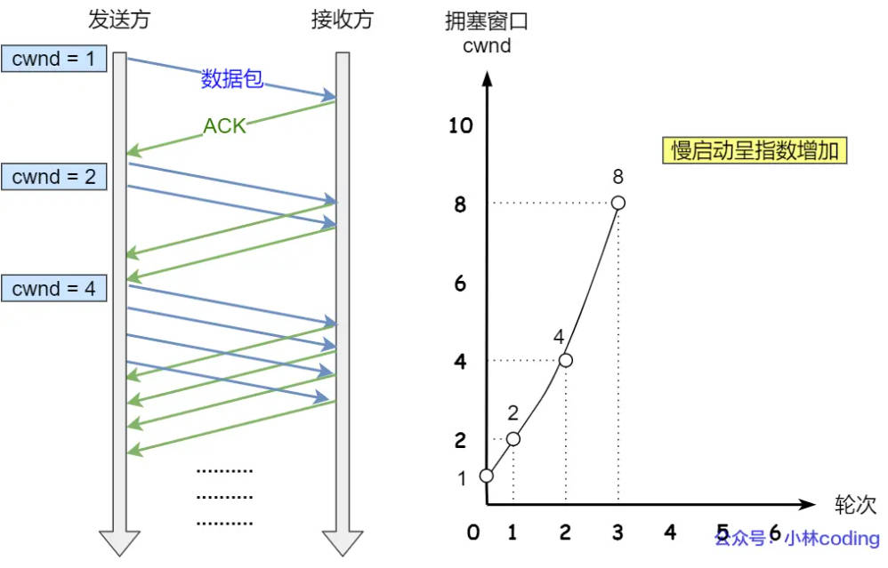
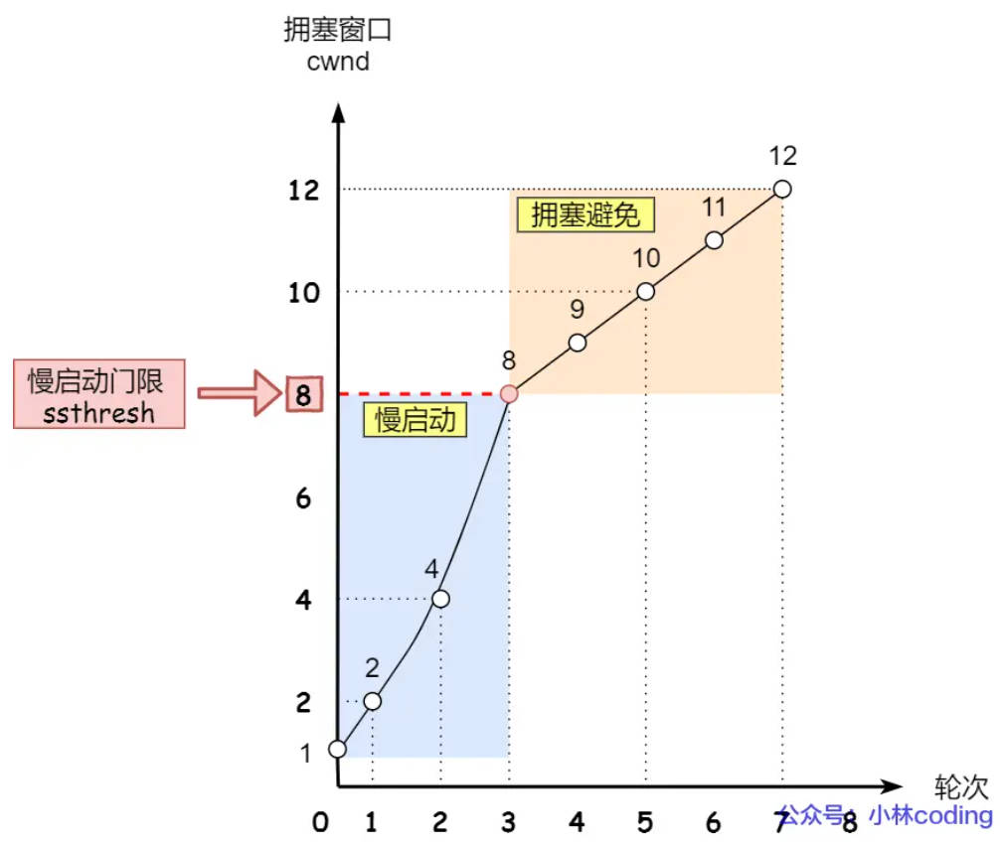
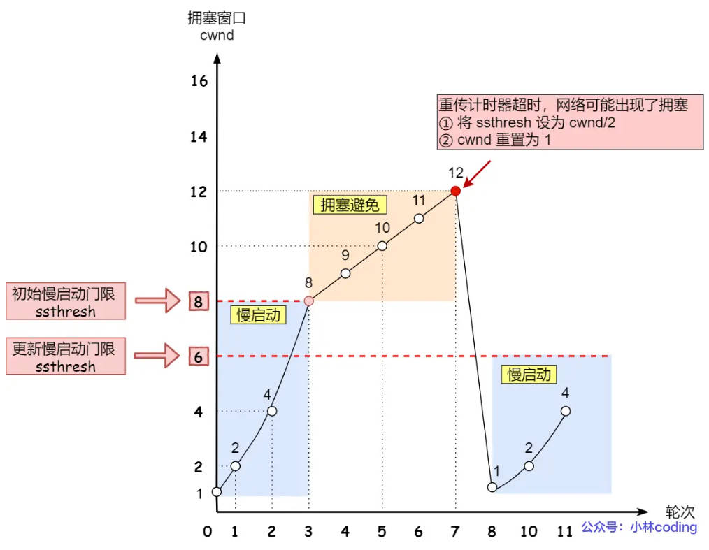
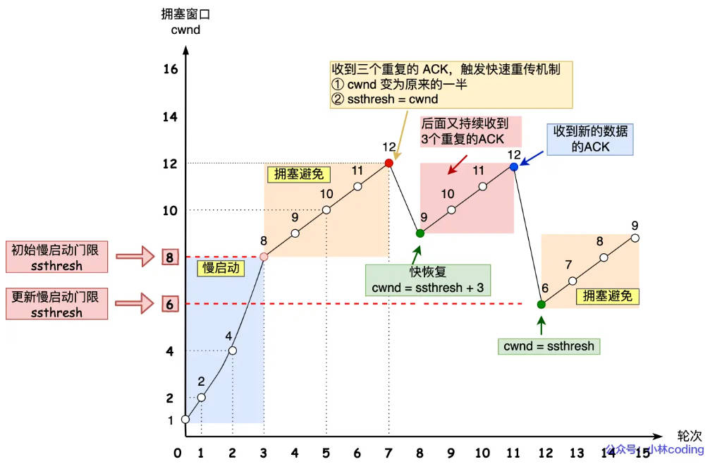

<style>
    p {
        text-indent: 2em; /* 首行缩进2字符 */d
    }
</style>

### STL中`push_back`和`emplace_back`的区别
**核心区别**

| 特性 | `push_back` | `emplace_back` |
|------|-------------|----------------|
| **参数** | 接受对象本身 | 接受构造函数的参数 |
| **构造次数** | 1次构造 + 1次拷贝/移动 | 1次直接构造 |
| **临时对象** | 可能产生临时对象 | 不产生临时对象 |
| **效率** | 较慢（可能多一次拷贝） | 更快（直接构造） |
| **适用版本** | C++98 起 | C++11 起 |

**基本用法对比**

```cpp
#include <vector>
#include <string>

struct Person {
    std::string name;
    int age;
    
    Person(const std::string& n, int a) : name(n), age(a) {
        std::cout << "构造: " << name << std::endl;
    }
    
    Person(const Person& other) : name(other.name), age(other.age) {
        std::cout << "拷贝构造: " << name << std::endl;
    }
    
    Person(Person&& other) noexcept : name(std::move(other.name)), age(other.age) {
        std::cout << "移动构造: " << name << std::endl;
    }
};
```

- 默认使用`emplace_back`，更灵活高效
- **不可拷贝类型**只能用`emplace_back`
- 初始化列表场景可以使用`push_back`
- `noexcept`声明函数不返回任何异常(比如不生成栈展开的额外代码)。移动语义本质为指针所有权转移，不涉及新的内存分配，因此一般不会抛出异常。`std::vector`扩容时，如果移动构造函数是`noexcept`，优先使用移动语义；如果不是则退化为拷贝语义。

| 类型 | 符号 | 含义 |
| :-- | :-- | :-- |
| 左值引用 | `T&` | 指向可寻址、有名字的变量 |
| 右值引用 | `T&&` | 指向即将销毁的临时对象 |
| 常引用 | `const T&` | 能绑定左或右值，但只能读 |

写一个类的复制拷贝函数(深拷贝问题)
```cpp
class MyClass{
private:
    char* data;
public:
// 构造函数
    MyClass(const char* str = "") : data(nullptr) {
        data = new char[strlen(str)+1];
        strcpy(data, str);
    }
// 拷贝构造
    MyClass(const MyClass& idx) : data(nullptr) {
        data = new char[strlen(idx.data)+1];
        strcpy(data, idx.data);
    }
// 重载赋值运算符
    MyClass& operator=(const MyClass& other) {
        if (this != &other) {
            delete[] data;
            data = new char[strlen(other.data)+1];
            strcpy(data, other.data);
        }
        return *this;
    }
// 析构
    ~MyClass(){
        delete[] data;
    }
/**
* MyClass的构造函数保证MyClass对象的data指向一个有效内存
* 这个内存至少为{'\0'}
* 但是在构造函数和拷贝构造中，将data初始化为nullptr
* 这样可以避免data为未定义的随机值（野指针）
* 如果new抛出异常，析构函数会执行`delete[] data`
* 由于此时data为野指针，将会发生未定义行为造成崩溃
*/
};
```
new和new[]会在内存中记录不同元数据，后者会在内存块头部记录数组大小（元素个数），delete[]会读取这个信息逐个调用析构函数；delete只会调用第一个元素的析构函数

### `map`和`unordered_map`的区别及使用场景
| 特性 | `std::map` | `std::unordered_map` |
|------|------------|----------------------|
| **底层实现** | 红黑树（平衡二叉搜索树） | 哈希表 |
| **元素顺序** | 按键自动排序（升序） | 无序 |
| **查找复杂度** | O(log n) | O(1) 平均，O(n) 最坏 |
| **插入复杂度** | O(log n) | O(1) 平均，O(n) 最坏 |
| **删除复杂度** | O(log n) | O(1) 平均，O(n) 最坏 |
| **空间占用** | 较小（每个节点多存指针） | 较大（需要哈希表数组） |
| **迭代器类型** | 双向迭代器 | 前向迭代器 |
| **内存布局** | 节点分散 | 桶连续 + 节点分散 |
| **适用版本** | C++98 起 | C++11 起 |

### map中的key按照自定义排序
`std::map`的模板定义：
```cpp
template<class Key, class T, class Compare = std::less<key>>
class map
```
其中`compare`就是key的排序比较器，默认形式为`std::less<key>`升序

**自定义方法**
1. 函数对象
   ```cpp
    #include <iostream>
    #include <map>
    #include <string>

    // 自定义比较器：按字符串长度降序（长 -> 短）
    struct CompareByLengthDesc {
        bool operator()(const std::string& a, const std::string& b) const {
            if (a.length() != b.length()) {
                return a.length() > b.length();  // 长度降序
            }
            return a < b;  // 长度相同时按字典序
        }
    };

    int main() {
        std::map<std::string, int, CompareByLengthDesc> myMap;
        
        myMap["apple"] = 1;
        myMap["banana"] = 2;
        myMap["cat"] = 3;
        myMap["dog"] = 4;
        
        for (const auto& [key, value] : myMap) {
            std::cout << key << ": " << value << std::endl;
        }
        // 输出顺序：banana (6), apple (5), cat (3), dog (3)
        // 注：cat 和 dog 长度相同，按字典序 cat < dog
        
        return 0;
    }
    ```
    在`return a < b`中，判断的是a、b的字典序，而非其值大小。`<`为`std::string`运算符，用途是逐个字符比较a和b的ASCII码

    `std::map`的第三个模板参数只作用于键，不涉及值
2. Lambda表达式
   ```cpp
   #include <iostream>
   #include <map>
   #include <string>

   int main() {
    // 定义lambda表达式
    auto cmp = [](const std::string& a, const std::string& b) {
        if (a.length() != b.length()) {
            return a.length() > b.length();  // 长度降序排列
        }
        return a < b;
    };
    // 使用decltype自动推导lambda类型，传入lambda对象
    std::map<std::string, int, decltype(cmp)> myMap(cmp);

    myMap["apple"] = 1;
    myMap["banana"] = 2;
    myMap["cat"] = 3;
    
    for (const auto& [key, value] : myMap) {
        std::cout << key << ": " << value << std::endl;
    }
    // 输出：banana: 2, apple: 1, cat: 3
    
    return 0;
   }
   ```
3. 函数指针
### 手撕memcpy
```cpp
# include <cstddef>     // std::size_t

void* my_memcpy(void* dest, const void* src, std::size_t count) {
    void* result = dest;
    // 判断无效情况
    if (dest == nullptr || src == nullptr || count = 0) {
        return result;
    }
    // 使用无符号字符（1字节）避免符号扩展问题
    unsigned char* d = static_cast<unsigned char*>(dest);
    const unsigned char* s = static_cast<const unsigned char*>(src);
    // 得到复制和源的低地址，判断是否存在风险区域
    if (d < s) {
        // 无风险
        for (std::size_t i = 0; i < count; i++) {
            d[i] = s[i];
        }
    } else {
        // 需从高位开始
        for (std::size_t i = count-1; i >=0; i--) {
            d[i] = s[i];
        }
    }
    return result;
}
```
`size_t`是C++中专门用于表示对象大小、数组长度的**无符号整数**类型，通常由`sizeof`返回。一般用于表示内存大小、数组索引、循环大小。在此例中，`size_t`用于表示内存中的字节数量。`sizeof`,`strlen`,`malloc`等内存相关标准库函数均采用`size_t`

### 谈谈STL
基于模板技术实现，提供大量可服用数据结构和算法
1. **容器**
用于储存数据

- 顺序容器：`vector`,`deque`,`list`,`forward_list`
- 关联容器：`set`,`map`,`multiset`,`multimap`
底层通常使用红黑树实现。自动有序。查找、插入、删除时间复杂度为O(logN)
- 无序关联容器：`unorderde_map`,`unordered_set`,`unordered_multimap`,`unordered_multiset`
底层使用哈希表。查找插入平均复杂度O(1)
2. 算法
```text
sort()
find()
count()
binary_search()
lower_bound()
upper_bound()
for_each()
remove()
reverse()
```
以上为常用通用算法
3. 迭代器
4. 仿函数
5. 适配器:对已有容器进行封装
典型用例
```text
stack
queue
priority_queue
```
6. 分配器：负责内存管理

### 哈希表及其原理

哈希表（Hash Table）是一种根据键（Key）直接访问数据的数据结构，其核心思想是通过哈希函数将键映射到数组中的某个位置，从而实现快速的查找、插入和删除操作。

哈希表主要由两部分组成：
1. 哈希函数（Hash Function）
2. 存储数据的桶（Bucket）数组

其工作过程如下：

当插入一个键值对时，首先通过哈希函数计算键对应的哈希值，然后根据哈希值确定元素应该存储的位置。例如：

查找时同样先计算哈希值，然后直接定位到对应桶，从而避免遍历整个容器，因此平均时间复杂度为 O(1)。

哈希冲突（Hash Collision）：不同的 Key 经过哈希计算后得到相同的位置。
```text
1 % 10 = 1
11 % 10 = 1
21 % 10 = 1
```
多个元素都会映射到同一个桶。

解决哈希冲突的方法：
1. 链地址法
每个桶维护一个链表或其他容器，发生冲突的元素挂接在同一个桶后面
```text
bucket[1]
   ↓
[1] -> [11] -> [21]
```
C++ STL 中的 unordered_map 和 unordered_set 通常采用这种思想实现。

2. 开放寻址法
发生冲突后不使用链表，而是在数组中继续寻找空闲位置。

### 介绍vector和list的区别

`vector` 和 `list` 都是 STL 中常用的容器，但它们的底层实现和适用场景有较大区别。

首先，`vector` 的底层是**动态数组**，而 `list` 的底层是**双向链表**。

1. 底层结构

#### vector

```text
+----+----+----+----+----+
| 1  | 2  | 3  | 4  | 5  |
+----+----+----+----+----+
```

特点：

* 内存连续存储
* 支持随机访问
* 可以通过下标直接访问元素

例如：

```cpp
vector<int> v{1,2,3};

cout << v[1];
```

访问时间复杂度为 O(1)。

---

#### list

```text
+-----+    +-----+    +-----+
|  1  |<-->|  2  |<-->|  3  |
+-----+    +-----+    +-----+
```

每个节点包含：

```cpp
prev + data + next
```

特点：

* 内存不连续
* 节点之间通过指针连接
* 不支持随机访问

例如：

```cpp
list<int> lst;
```

不能写：

```cpp
lst[2];
```

因为链表必须从头开始逐个遍历。

---

2. 随机访问能力

#### vector

由于内存连续：

```cpp
v[i];
```

底层实际上是：

```cpp
*(begin + i)
```

时间复杂度：

```text
O(1)
```

---

#### list

链表需要逐个节点查找：

```text
head -> node1 -> node2 -> node3 ...
```

时间复杂度：

```text
O(N)
```

因此：

* vector 支持随机访问迭代器
* list 仅支持双向迭代器

很多 STL 算法（如 sort、binary_search）更适合 vector。

---

3. 插入和删除

#### vector

尾部插入：

```cpp
v.push_back(x);
```

平均：

```text
O(1)
```

但如果容量不足发生扩容：

```text
申请新空间
↓
拷贝旧数据
↓
释放旧空间
```

代价较大。

中间插入：

```cpp
v.insert(pos, x);
```

需要移动后续元素：

```text
O(N)
```

例如：

```text
1 2 3 4 5

插入到2后面

1 2 x 3 4 5
```

后面的元素都要向后移动。

---

#### list

链表插入：

```cpp
lst.insert(pos, x);
```

只需要修改几个指针：

```text
prev -> newNode -> next
```

时间复杂度：

```text
O(1)
```

删除同理：

```cpp
lst.erase(pos);
```

也是 O(1)。

因此频繁中间插入删除时，list 更有优势。

---

4. 内存占用

#### vector

每个元素只保存数据：

```text
[data]
```

额外开销很小。

---

#### list

每个节点除了数据外还需要：

```text
prev指针
next指针
```

例如 64 位系统：

```text
8B prev
8B next
```

因此链表内存开销明显更大。

---

5. 缓存友好性

这是实际项目中非常重要的一点。

#### vector

连续内存：

```text
1 2 3 4 5 6 7 8
```

CPU 预取效果好。

访问时：

```cpp
for(auto& x : v)
```

通常缓存命中率较高。

---

#### list

节点分散：

```text
node1 -> 0x1000
node2 -> 0x8000
node3 -> 0x3000
```

CPU 很难预取。

缓存命中率较低。

因此即使理论上 list 的插入删除复杂度更优，很多实际场景下 vector 依然更快。

---

6. 迭代器失效

#### vector

扩容时：

```cpp
push_back()
```

可能导致整块内存重新申请。

此时：

```cpp
iterator
pointer
reference
```

全部失效。

---

#### list

节点独立存在。

插入删除某个节点时：

```text
其它节点迭代器仍然有效
```

只有被删除节点对应的迭代器失效。

---

**总结**

| 对比项   | vector  | list  |
| ----- | ------- | ----- |
| 底层结构  | 动态数组    | 双向链表  |
| 内存布局  | 连续      | 非连续   |
| 随机访问  | O(1)    | O(N)  |
| 尾部插入  | O(1)    | O(1)  |
| 中间插入  | O(N)    | O(1)  |
| 中间删除  | O(N)    | O(1)  |
| 缓存友好  | 好       | 差     |
| 内存开销  | 小       | 大     |
| 迭代器类型 | 随机访问迭代器 | 双向迭代器 |

因此在实际开发中，如果主要需求是存储和访问数据，我通常优先选择 vector，因为它缓存友好、访问速度快；只有在需要频繁进行中间位置插入和删除，并且已经持有对应迭代器的场景下，我才会考虑使用 list。


### 堆上初始化和栈上初始化
| 特性 | 栈上初始化 | 堆上初始化 |
| :-- | :-- | :-- | :-- |
| 内存区域 | 栈Stack | 堆Heap |
| 分配速度 | 快(移动指针) | 慢(需要查找空闲内存) |
| 管理方式 | 自动管理，作用域结束自动释放 | 手动管理，需要`delete` |
| 生命周期 | 随作用域 | 手动控制 |
| 大小限制 | 较小，通常为1-8MB | 较大 |
| 分配时机 | 编译时确定大小 | 运行时动态分配 |

栈上初始化 
```cpp
// 1. 基础类型
int a = 10;
int b(20);      // 直接初始化
int c{30};      // C++11 统一初始化

// 2. 数组
int arr[10];                    // 固定大小
int arr2[5] = {1, 2, 3, 4, 5};

// 3. 对象
std::string str = "hello";
MyClass obj;
MyClass obj2(10, "test");
MyClass obj3{10, "test"};       // C++11
```
```text
// 内存布局
栈内存（高地址 → 低地址）
┌─────────────────────────────┐  ← 栈顶
│  局部变量 str                │
├─────────────────────────────┤
│  局部变量 obj                │
├─────────────────────────────┤
│  局部变量 arr[10]           │
├─────────────────────────────┤
│  main 函数返回地址           │
├─────────────────────────────┤
│  ...                        │
└─────────────────────────────┘  ← 栈底
```

堆上初始化
```cpp
// C 风格（不推荐在 C++ 中使用）
int* p = (int*)malloc(sizeof(int));
*p = 10;
free(p);

// C++ 传统方式
int* p1 = new int(10);           // 单个变量
int* p2 = new int[10];           // 数组
MyClass* obj = new MyClass();    // 对象
MyClass* obj2 = new MyClass(10, "test");

// 必须手动释放
delete p1;
delete[] p2;
delete obj;
delete obj2;

// C++14/17 推荐方式（智能指针）
std::unique_ptr<int> up = std::make_unique<int>(10);
std::unique_ptr<MyClass> uobj = std::make_unique<MyClass>(10, "test");

std::shared_ptr<MyClass> sp = std::make_shared<MyClass>(10, "test");

// 自动释放，无需手动 delete
```
```text
// 内存布局
堆内存（低地址 → 高地址）
┌─────────────────────────────┐
│  空闲内存块                  │
├─────────────────────────────┤
│  new MyClass 分配的内存      │ ← obj 指向这里
├─────────────────────────────┤
│  new int[10] 分配的内存      │ ← p2 指向这里
├─────────────────────────────┤
│  空闲内存块                  │
├─────────────────────────────┤
│  ...                        │
└─────────────────────────────┘

栈上（持有堆内存的指针）
┌─────────────────────────────┐
│  MyClass* obj ──────────────┼──→ 指向堆上的对象
├─────────────────────────────┤
│  int* p2 ───────────────────┼──→ 指向堆上的数组
└─────────────────────────────┘
```

### 手撕vector的resize

resize和reserve
| 操作 | `resize` | `reserve` |
| :-- | :-- | :-- |
| 改变size | 是 | 否 |
| 改变capacity | 可能(when n > capacity) | 是(增加到>=n) |
| 触发重新分配 | 仅当`n > capacity` | 同`resize` |

```cpp
#include <iostream>
#include <vector>

int main() {
    std::vector<int> vec;
    
    // 情况1：当前 size = 0, capacity = 0
    vec.resize(5);   // 5 > capacity(0) → 重新分配，构造 5 个零值元素
    std::cout << "size=" << vec.size() << ", cap=" << vec.capacity() << "\n";
    // 输出：size=5, cap=5（或更大）
    
    // 情况2：当前 size = 5, capacity = 5
    vec.resize(3);   // 3 < size → 不重新分配，销毁末尾 2 个元素
    std::cout << "size=" << vec.size() << ", cap=" << vec.capacity() << "\n";
    // 输出：size=3, cap=5（容量不变）
    
    // 情况3：当前 size = 3, capacity = 5
    vec.resize(8);   // 8 > capacity → 重新分配，容量增长到至少 8
    std::cout << "size=" << vec.size() << ", cap=" << vec.capacity() << "\n";
    // 输出：size=8, cap=10（通常翻倍策略）
}
```

### STL中map的底层是如何实现的？红黑树为什么是相对平衡的？为什么不选择AVL？
1. map底层使用红黑树实现，他满足：
   1. 元素按照Key自动有序
   2. 查找、插入、删除效率稳定
2. 红黑树是什么
本质：二叉搜索树
在BST基础上增加颜色属性
- 每个节点非黑即红
- 根节点必须为黑色
- 所有叶节点(**NULL空节点，即空指针对应的哨兵节点**)都是黑色
- 红色节点不能连续出现
- 从任意节点到其叶子节点路径上的黑色节点数量相同
3. 为什么不选AVL而是红黑树？
AVL（平衡二叉树）为一颗空树或者左右两个字数高度差绝对值不超过1，它的查找速度更快
但是，AVL树插入、删除调整更多，旋转次数更多

红黑树查找稍慢，但是插入删除快、旋转少，面对map的经典场景（频繁插入、删除、查找）具有更好的综合性能。

### 以vector的新方法为例，介绍你了解的C++11新特性
1. `push_back`和移动语义
C++11之前：
```cpp
vector<string> vec; 
string str = "hello"; 
vec.push_back(str);
```
调用拷贝构造`string(const string&);`，产生一次对象拷贝

C++11引入右值引用后：：
```cpp
vec.push_back(std::move(str));
```
调用移动构造`string(const string&&);`转移指针所有权，直接管理内部资源

2. `emplace_back`
传统`push_back`先构造临时对象，再将其拷贝/移动到vector，至少涉及一次额外对象构造
`emplace_back`直接在容器内部构造，效率更高

3. 扩容优化
C++11之前，vector扩容需要迁移旧元素，从旧空间拷贝到新空间，调用大量拷贝构造
C++11之后，如果对象支持移动构造`string(string&&)`，扩容时优先移动，成本显著降低
4. 统一初始化
以前：
```cpp
vectror<int> vec;
vec.push_back(1);
vec.push_back(2);
```
现在：
```cpp
vector<int> vec{1, 2};
```
5. 范围for循环

### 能否自己写一个RAII类？
```cpp
#include <iostream>
#include <stdexcept>
#include <cstring>

// 自定义RAII类，管理动态内存
template<typename T>
class My_unique_ptr{
private:
    T* ptr;     // 对象

public:
    // 构造函数，获取资源
    explicit My_unique_ptr(T* p = nullptr): ptr(p) {
        std::cout << "获取资源：" << ptr << std::endl;
    }
    // 析构函数，释放资源
    ~ My_unique_ptr() {
        if (ptr) {
            std::cout << "释放资源：" << ptr <<std::endl;
        }
        delete ptr;
    }
    // 禁止拷贝，防止double delete
    My_unique_ptr(const My_unique_ptr&) = delete;
    My_unique_ptr& opetator=(const My_unqiue_ptr&) = delete;
    // 移动语义，转移资源
    My_unique_ptr(My_unique_ptr&& other) noexcept : ptr(other.ptr) {
        other.ptr = nullptr;
        std::cout << "移动构造，转移所有权" << std::endl;
    }
    My_unique_ptr& operator=(My_unique_ptr&& other) noexcept {
        if (this != &other) {
            delete ptr; // 释放当前资源
            ptr = other.ptr;    // 接管新资源
            other.ptr = nullptr;
            std::cout << "移动幅值，转移所有权" << endl;
        }
        return *this;
    }
    // 5. 访问接口
    T& operator*() const { return *ptr; }
    T* operator->() const { return ptr; }
    T* get() const { return ptr; }

    // 6. 显式释放（可选）
    void reset(T* p = nullptr) {
        if (ptr != p) {
            delete ptr;
            ptr = p;
        }
    }
};

// 使用示例
class Person {
public:
    int age;

    Person(const std::string& n, int a) : name(n), age(a) {
        std::cout << "Person构造" << name << std::endl;
    }
    ~Person() {
        std::cout << "Person析构" << name << std::endl;
    }
    void speak() const {
        std::cout << "我是 " << name << "，今年 " << age << " 岁" << std::endl;
    }
};

int main() {
    std::cout << "=== 测试1：正常生命周期 ===\n";
    {
        My_unique_ptr<Person> p1(new Person("Alice", 25));
        p1->speak();  // 使用箭头运算符
        (*p1).speak(); // 使用解引用运算符
        // p1 离开作用域时自动释放
    }
    std::cout << "p1 已析构，内存已释放\n\n";

    std::cout << "=== 测试2：移动语义 ===\n";
    {
        My_unique_ptr<Person> p2(new Person("Bob", 30));
        My_unique_ptr<Person> p3 = std::move(p2);  // 移动构造，所有权转移
        
        if (p2.get() == nullptr) {
            std::cout << "p2 现在是空指针\n";
        }
        p3->speak();
        // p3 离开作用域时释放资源
    }
    std::cout << "p3 已析构，内存已释放\n\n";

    std::cout << "=== 测试3：异常安全 ===\n";
    try {
        My_unique_ptr<Person> p4(new Person("Charlie", 35));
        throw std::runtime_error("发生异常！");
        // 即使抛异常，p4 的析构函数依然会被调用
    } catch (const std::exception& e) {
        std::cout << "捕获异常: " << e.what() << std::endl;
        // p4 已经在栈展开时被析构，内存已释放
    }

    return 0;
}
```
```cpp
// before
for(vector<int>::iterator it = vec.begin();
    it != vec.end();
    ++it)
{
    cout << *it << endl;
}

// C++11：
for(auto& x : vec)
{
    cout << x << endl;
}
```

### MySql底层使用什么数据库结构？
MySql底层使用B+树：
- 所有数据都在叶子节点
- 叶子结点按顺序用双向链表连接
- 非叶子节点只存放key，不存放数据
- 树一般高2~4层
为什么B+树旁且矮？
通过在一个节点中存放大量key提高分支因子，可以显著降低树高，从而将一次查询的随机IO次数控制在很小的范围内。这种结构比手稿的二叉平衡树更适合磁盘和缓存系统

### 析构函数和构造函数是否可以抛出异常？
构造函数可以抛出异常，用于表示对象构造失败。此时已构造完成的成员会被正确析构

析构函数原则上不应抛出异常，C++11之后析构函数默认是`noexcept`，实践中需要保证期不抛异常

### 介绍一下进程和线程的区别
进程（Process）：

- 操作系统进行资源分配的基本单位
- 程序的一次执行过程，拥有独立的内存空间
- 每个进程都有自己的代码段、数据段、堆栈段

线程（Thread）：

- 操作系统进行CPU调度的基本单位
- 进程内的一个执行流，共享进程的资源
- 同一个进程内的多个线程共享代码段、数据段、堆段，但有自己的栈段

```text
┌─────────────────────────────────────┐
│              进程                   │
│  ┌─────────────────────────────────┐│
│  │   代码段、数据段、堆段           │ │
│  │   (所有线程共享)                 ││
│  └─────────────────────────────────┘│
│  ┌─────┐  ┌─────┐  ┌─────┐          │
│  │线程1 │ │线程2 │ │线程3 │          │
│  │ 栈  │  │ 栈  │  │ 栈  │          │
│  └─────┘  └─────┘  └─────┘          │
└─────────────────────────────────────┘
```

### 介绍一下TCP三次握手
TCP三次握手建立连接:
```txt
客户端（主动）                  服务器（被动）
   |                              |
   | ------ SYN (SEQ=x) --------> |  (1) 请求连接
   |                              |
   | <--- SYN+ACK (SEQ=y, ACK=x+1) |  (2) 确认并请求
   |                              |
   | --- ACK (SEQ=x+1, ACK=y+1) -> |  (3) 最终确认
   |                              |
   | ==== 连接建立，开始传输数据 ==== |
```

- **为什么不是两次握手**：如果只有两次，服务器发出确认后即认为连接建立，如果客户端没有收到，则会造成服务器资源浪费。三次握手确保双方都有收发能力
- **什么是SYN洪水攻击**：恶意客户端只发送第一次握手，不回应第三次，导致服务器挂起大量半连接，浪费资源

TCP四次握手断开连接：
```txt
主动关闭方 (Client)               被动关闭方 (Server)
   |                                    |
   | ---- FIN (SEQ=u) ----------------> | (1) 主动方说“我不发了”
   |                                    |
   | <--- ACK (SEQ=v, ACK=u+1) -------- | (2) 被动方确认，但可能还有数据要发
   |                                    |
   |      (此时被动方继续发送剩余数据)      |
   |                                    |
   | <--- FIN (SEQ=w) ---------------- | (3) 被动方说“我也发完了”
   |                                    |
   | ---- ACK (SEQ=w+1) --------------> | (4) 主动方最后确认
   |                                    |
   | (等待 2MSL 后关闭)                  | (收到ACK后立即关闭)
```

- **为什么不是三次握手**：第二次和第三次握手不能合并，被动放需要把剩余数据发完
- **TIME_WAIT状态**：主动关闭方发送随后一次ACK后，等待**2倍最大报文时间**
  - 确保被动房收到最后的ACK。如果没收到，被动方会重发FIN，主动方还能重发ACK
  - 让网络中残留的旧数据包全部消失，避免影响下一次使用相同端口的新连接

### 网络封装格式
| 层级 | 封装格式 |
| :-- | :-- |
| 应用层 | 应用数据 |
| 传输层 | TCP头-应用数据 |
| 网络层 | IP头-TCP头-应用数据 |
| 链路层 | 帧头(MAC头)-IP头-TCP头-应用数据-帧尾(FCS校验) |
| 物理层 | (进行比特流传输) |

### 介绍一下键入网址到网页显示的流程
- 浏览器解析URL，确认Web服务器和文件名，生成`HTTP`请求
- DNS查询真实地址
  - 浏览器解析URL、生成HTTP消息后，需要委托操作系统将消息发送给Web服务器
  - DNS服务器存储了Web服务器域名与IP的对应关系
- 通过DNS获取IP后，将HTTP传输工作交给操作系统的协议栈
- 进行TCP可靠传输，为数据包添加TCP头
- IP模块将数据封装为网络包发送给通信对象，为其添加IP头
- 在IP头前加上MAC头，包含收发双方的MAC地址等信息
  - 发送方MAC地址在网卡生产时写入ROM中
  - 接收方MAC地址通过ARP(地址解析)协议，在以太网中广播询问IP地址对应设备的MAC地址
- 网卡添加起始帧和校验帧，将保转为电信号通过网线发送
- 交换机转发网络包
  - 交换机根据MAC地址表查找MAC地址，将信号发送到相应端口
  - 如果没查找到则进行广播
- 路由器转发数据包
  - 接收包，将电信好在换为数字信号
  - 查询路由表确定输出端口
  - 发送数据包
- 接收方接受并解析数据包

### socket是什么？
socket套接字是一个编程接口，它是操作系统提供的一个抽象层，相当于应用层与传输层之间的接口位置
应用程序通过系统调用与socket进行数据交互

### 建立一个TCP连接需要客户端与服务端就哪些信息达成共识？
- Socket：由IP和端口号组成
- 序列号：解决乱序问题
- 窗口大小：流量控制

### 一个服务端监听了一个端口，它的最大连接数是多少？
服务端通常固定在某个本地端口上监听，等待客户端的连接请求。
客户端 IP 和端口是可变的，其理论值计算公式如下：
**最大TCP连接数 = 客户端IP数 * 客户端端口数**
在IPv4中，客户端IP数最多为2^32， 端口数最多为2^16.因此服务端最大TCP连接数为2^48

### 为什么每次建立TCP连接时，初始化的序列号要求不一样？
考虑以下2情景：
- 客户端和服务端建立一个 TCP 连接，在客户端发送数据包被网络阻塞了，然后超时重传了这个数据包，而此时服务端设备断电重启了，之前与客户端建立的连接就消失了，于是在收到客户端的数据包的时候就会发送 RST 报文。
- 紧接着，客户端又与服务端建立了与上一个连接相同四元组的连接；
- 在新连接建立完成后，上一个连接中被网络阻塞的数据包正好抵达了服务端，刚好该数据包的序列号正好是在服务端的接收窗口内，所以该数据包会被服务端正常接收，就会造成数据错乱

### 握手丢失会发生什么？
1. 第一次握手丢失
   - 客户端想和服务端建立 TCP 连接的时候，首先第一个发的就是 SYN 报文，然后进入到 SYN_SENT 状态。
   - 如果客户端迟迟收不到服务端的 SYN-ACK 报文（第二次握手），就会触发「超时重传」机制，**以相同序列号重传** SYN 报文
   - 一般来说，Linux中最大重传次数为5，每次等待时间翻倍，第五次重传后继续等待32秒，如果服务端仍然没有回应 ACK，客户端就不再发送 SYN 包，然后断开 TCP 连接。总耗时为63秒。
2. 第二次握手丢失
   - 当服务端收到客户端的第一次握手后，就会回 SYN-ACK 报文(其中，SYN是服务端发起建立TCP连接的报文；ACK是对第一次握手的确认报文)给客户端，这个就是第二次握手，此时服务端会进入 SYN_RCVD 状态
   - 如果第二次握手丢失，**客户端没收到ACK，触发超时重传机制，重传 SYN 报文**，**服务端没收到第三次握手，触发超时重传机制，重传 SYN-ACK 报文**
3. 第三次握手丢失
   - 客户端收到服务端的 SYN-ACK 报文后，就会给服务端回一个 ACK 报文，也就是第三次握手，此时客户端状态进入到 ESTABLISH 状态
   - **ACK 报文是不会有重传的，当 ACK 丢失了，就由对方重传对应的报文**
   - 当第三次握手丢失了，如果服务端那一方迟迟收不到这个确认报文，就会触发超时重传机制，重传 SYN-ACK 报文，直到收到第三次握手，或者达到最大重传次数

### HTTP报文有哪些部分
- 请求报文：
  - 请求行：包含请求方法、请求目标（URL或URI）和HTTP协议版本。
  - 请求头部：包含关于请求的附加信息，如Host、User-Agent、Content-Type等。
  - 空行：请求头部和请求体之间用空行分隔。
  - 请求体：可选，包含请求的数据，通常用于POST请求等需要传输数据的情况。
- 响应报文：
  - 状态行：包含HTTP协议版本、状态码和状态信息。
  - 响应头部：包含关于响应的附加信息，如Content-Type、Content-Length等。
  - 空行：响应头部和响应体之间用空行分隔。
  - 响应体：包含响应的数据，通常是服务器返回的HTML、JSON等内容。

常用HTTP状态码：
- 200：请求成功
- 301：永久重定向。说明请求的资源已经不存在了，需改用新的 URL 再次访问
- 302：临时重定向。说明请求的资源还在，但暂时需要用另一个 URL 来访问
- 404：无法找到页面
- 405：请求的方法类型不支持
- 500：服务器内部出错
- 502：网关或者代理工作的服务器尝试执行请求时，从上游服务器接收到无效的响应
- 504：网关或者代理工作的服务器尝试执行请求时，未能及时从上游服务器收到响应

### GET和POST的使用场景和区别
GET：从服务器获取指定的资源。安全、幂等(多次操作结果一样)
*比如，你打开我的文章，浏览器就会发送 GET 请求给服务器，服务器就会返回文章的所有文字及资源*
POST：根据请求负荷（报文body）对指定的资源做出处理。不安全、不幂等
*比如，你在我文章底部，敲入了留言后点击「提交」，浏览器就会执行一次 POST 请求，把你的留言文字放进了报文 body 里，然后拼接好 POST 请求头，通过 TCP 协议发送给服务器*

### HTTPS和HTTP的区别
- HTTP 是超文本传输协议，信息是明文传输，存在安全风险的问题。HTTPS 则解决 HTTP 不安全的缺陷，在 TCP 和 HTTP 网络层之间加入了 SSL/TLS 安全协议，使得报文能够加密传输。
- HTTP 连接建立相对简单， TCP 三次握手之后便可进行 HTTP 的报文传输。而 HTTPS 在 TCP 三次握手之后，还需进行 SSL/TLS 的握手过程，才可进入加密报文传输。
- 两者的默认端口不一样，HTTP 默认端口号是 80，HTTPS 默认端口号是 443。
- HTTPS 协议需要向 CA（证书权威机构）申请数字证书，来保证服务器的身份是可信的

### HTTP进行TCP连接后，在什么情况下会中断？
1. 服务端或客户端只想close刺痛调用时，发送FIN报文，进行四次握手断开连接
2. 发送方发送数据后，接收方超过一段时间没有响应ACK报文，发送方重传数据达到最大次数的时候，就会断开TCP连接
3. HTTP长时间没有进行请求和响应的时候，超过一定的时间，就会释放连接

### HTTP、SOCKET和TCP的区别
- HTTP是一种用于传输超文本数据的应用层协议，用于在客户端和服务器之间传输和显示Web页面。
- Socket是计算机网络中的一种抽象，用于描述通信链路的一端，提供了底层的通信接口，可实现不同计算机之间的数据交换。
- TCP是一种面向连接的、可靠的传输层协议，负责在通信的两端之间建立可靠的数据传输连接

### 什么是DNS？
Domain Name System（域名系统）是互联网中用于将域名转换为对应IP地址的分布式数据库系统。DNS扮演着重要的角色，使得人们可以通过易记的域名访问互联网资源，而无需记住复杂的IP地址。DNS底层同时使用TCP和UDP，端口均为53

DNS层级关系：
- 根 DNS 服务器（.）
- 顶级域 DNS 服务器（.com）
- 权威 DNS 服务器（server.com）

工作流程：
1. 客户端首先会发出一个 DNS 请求，问 www.server.com 的 IP 是啥，并发给本地 DNS 服务器（也就是客户端的 TCP/IP 设置中填写的 DNS 服务器地址）。
2. 本地域名服务器收到客户端的请求后，如果缓存里的表格能找到 www.server.com，则它直接返回 IP 地址。如果没有，本地 DNS 会去问它的根域名服务器：“老大， 能告诉我 www.server.com 的 IP 地址吗？” 根域名服务器是最高层次的，它不直接用于域名解析，但能指明一条道路。
3. 根 DNS 收到来自本地 DNS 的请求后，发现后置是 .com，说：“www.server.com 这个域名归 .com 区域管理”，我给你 .com 顶级域名服务器地址给你，你去问问它吧。”
4. 本地 DNS 收到顶级域名服务器的地址后，发起请求问“老二， 你能告诉我 www.server.com 的 IP 地址吗？”
5. 顶级域名服务器说：“我给你负责 www.server.com 区域的权威 DNS 服务器的地址，你去问它应该能问到”。
6. 本地 DNS 于是转向问权威 DNS 服务器：“老三，www.server.com对应的IP是啥呀？” server.com 的权威 DNS 服务器，它是域名解析结果的原出处。为啥叫权威呢？就是我的域名我做主。
7. 权威 DNS 服务器查询后将对应的 IP 地址 X.X.X.X 告诉本地 DNS。
8. 本地 DNS 再将 IP 地址返回客户端，客户端和目标建立连接

### HTTP是不是无状态的？
虽然HTTP本身是无状态的，但可以通过一些机制来实现状态保持，其中最常见的方式是使用Cookie和Session来跟踪用户状态。通过在客户端存储会话信息或状态信息，服务器可以识别和跟踪特定用户的状态，以提供一定程度的状态保持功能

### Cookie和Session有什么区别？
二者都是Web开发中用于跟踪目标状态的技术，但是：
- **存储位置**：Cookie的数据存储在客户端（通常是浏览器）。当浏览器向服务器发送请求时，会自动附带Cookie中的数据。Session的数据存储在服务器端。服务器为每个用户分配一个唯一的Session ID，这个ID通常通过Cookie或URL重写的方式发送给客户端，客户端后续的请求会带上这个Session ID，服务器根据ID查找对应的Session数据。
- **数据容量**：单个Cookie的大小限制通常在4KB左右，而且大多数浏览器对每个域名的总Cookie数量也有限制。由于Session存储在服务器上，理论上不受数据大小的限制，主要受限于服务器的内存大小。
- **安全性**：Cookie相对不安全，因为数据存储在客户端，容易受到XSS（跨站脚本攻击）的威胁。不过，可以通过设置HttpOnly属性来防止JavaScript访问，减少XSS攻击的风险，但仍然可能受到CSRF（跨站请求伪造）的攻击。Session通常认为比Cookie更安全，因为敏感数据存储在服务器端。但仍然需要防范Session劫持（通过获取他人的Session ID）和会话固定攻击。
- **生命周期**：Cookie可以设置过期时间，过期后自动删除。也可以设置为会话Cookie，即浏览器关闭时自动删除。Session在默认情况下，当用户关闭浏览器时，Session结束。但服务器也可以设置Session的超时时间，超过这个时间未活动，Session也会失效。
- **性能**：使用Cookie时，因为数据随每个请求发送到服务器，可能会影响网络传输效率，尤其是在Cookie数据较大时。使用Session时，因为数据存储在服务器端，每次请求都需要查询服务器上的Session数据，这可能会增加服务器的负载，特别是在高并发场景下

### token、session和cookie的区别?
- session存储于服务器，可以理解为一个状态列表，拥有一个唯一识别符号sessionId，通常存放于cookie中。服务器收到cookie后解析出sessionId，再去session列表中查找，才能找到相应session，依赖cookie。
- cookie类似一个令牌，装有sessionId，存储在客户端，浏览器通常会自动添加。
- token也类似一个令牌，无状态，用户信息都被加密到token中，服务器收到token后解密就可知道是哪个用户，需要开发者手动添加

### HTTP长连接和WebSocket有什么区别？
- 单工：单向传输
- 半双工：双向交替，同一时刻只能一个方向传输
- 全双工：双向同时，可以同时在两个方向传输 

TCP协议为全双工。HTTP虽然基于TCP，但是它是半双工的，对于大部分需要服务器主动推送数据到客户端的场景，都不太友好。因此我们需要使用支持全双工的 WebSocket 协议

在应用场景上，在 HTTP/1.1 里，只要客户端不问，服务端就不答。基于这样的特点，对于登录页面这样的简单场景，可以使用定时轮询或者长轮询的方式实现服务器推送(comet)的效果。对于客户端和服务端之间需要频繁交互的复杂场景，比如网页游戏，都可以考虑使用 WebSocket 协议

### 介绍一下TCP拥塞控制
计算机网络都处在一个共享的环境。因此也有可能会因为其他主机之间的通信使得网络拥堵。

在网络出现拥堵时，如果继续发送大量数据包，可能会导致数据包时延、丢失等，这时 TCP 就会重传数据，但是一重传就会导致网络的负担更重，于是会导致更大的延迟以及更多的丢包，这个情况就会进入恶性循环被不断地放大。拥塞控制就是为了避免发送方数据填满整个网络

拥塞窗(cwnd)：发送方维护的一个的状态变量，会根据网络的拥塞程度动态变化。只要「发送方」没有在规定时间内接收到 ACK 应答报文，也就是发生了超时重传，就会认为网络出现了拥塞

拥塞控制方法：
1. 慢启动
TCP 在刚建立连接完成后，首先进行慢启动。发送方每收到一个 ACK，拥塞窗口 cwnd 的大小就会加 1。
- 连接建立完成后，一开始初始化 cwnd = 1，表示可以传一个 MSS 大小的数据。
- 当收到一个 ACK 确认应答后，cwnd 增加 1，于是一次能够发送 2 个
- 当收到 2 个的 ACK 确认应答后， cwnd 增加 2，于是就可以比之前多发2 个，所以这一次能够发送 4 个
- 当这 4 个的 ACK 确认到来的时候，每个确认 cwnd 增加 1， 4 个确认 cwnd 增加 4，于是就可以比之前多发 4 个，所以这一次能够发送 8 个
慢启动过程中，发包个数呈指数增长。使用状态变量**慢启动门限ssthresh**控制其过程。当cwnd大于该门限时，使用**拥塞避免算法**

2. 拥塞避免
每当收到一个 ACK 时，cwnd 增加 `1/cwnd`。由指数增长变为线性增长。随着发包增加，网络慢慢进入拥塞状态，出现丢包。此时进入**拥塞发生算法**

3. 拥塞发生
这个阶段的重传机制分为两种：
- 超时重传
使用拥塞发生算法

  - 慢启动门限变为cwnd的一半
  - cwnd重置为1
  - 重新开始慢启动
- 快速重传
当接收方发现丢了一个中间包的时候，发送三次前一个包的 ACK，于是发送端就会快速地重传，不必等待超时再重传
  - cwnd = cwnd/2 ，也就是设置为原来的一半;
  - ssthresh = cwnd;
  - 进入快速恢复算法
4. 快速恢复

- 拥塞窗口 cwnd = ssthresh + 3 （ 3 的意思是确认有 3 个数据包被收到了）；
- 重传丢失的数据包；
- 如果再收到重复的 ACK，那么 cwnd 增加 1；
- 如果收到新数据的 ACK 后，把 cwnd 设置为第一步中的 ssthresh 的值，原因是该 ACK 确认了新的数据，说明从 duplicated ACK 时的数据都已收到，该恢复过程已经结束，可以回到恢复之前的状态了，也即再次进入拥塞避免状态；

### 描述一下打开百度首页的过程
- 解析URL：分析 URL 所需要使用的传输协议和请求的资源路径。如果输入的 URL 中的协议或者主机名不合法，将会把地址栏中输入的内容传递给搜索引擎。如果没有问题，浏览器会检查 URL 中是否出现了非法字符，则对非法字符进行转义后在进行下一过程。
- 缓存判断：浏览器缓存 → 系统缓存（hosts 文件） → 路由器缓存 → ISP 的 DNS 缓存，如果其中某个缓存存在，直接返回服务器的IP地址。
- DNS解析：如果缓存未命中，浏览器向本地 DNS 服务器发起请求，最终可能通过根域名服务器、顶级域名服务器（.com）、权威域名服务器逐级查询，直到获取目标域名的 IP 地址。
- 获取MAC地址：当浏览器得到 IP 地址后，数据传输还需要知道目的主机 MAC 地址，因为应用层下发数据给传输层，TCP 协议会指定源端口号和目的端口号，然后下发给网络层。网络层会将本机地址作为源地址，获取的 IP 地址作为目的地址。然后将下发给数据链路层，数据链路层的发送需要加入通信双方的 MAC 地址，本机的 MAC 地址作为源 MAC 地址，目的 MAC 地址需要分情况处理。通过将 IP 地址与本机的子网掩码相结合，可以判断是否与请求主机在同一个子网里，如果在同一个子网里，可以使用 ARP 协议获取到目的主机的 MAC 地址，如果不在一个子网里，那么请求应该转发给网关，由它代为转发，此时同样可以通过 ARP 协议来获取网关的 MAC 地址，此时目的主机的 MAC 地址应该为网关的地址。
- 建立TCP连接：主机将使用目标 IP地址和目标MAC地址发送一个TCP SYN包，请求建立一个TCP连接，然后交给路由器转发，等路由器转到目标服务器后，服务器回复一个SYN-ACK包，确认连接请求。然后，主机发送一个ACK包，确认已收到服务器的确认，然后 TCP 连接建立完成。
- HTTPS 的 TLS 四次握手：如果使用的是 HTTPS 协议，在通信前还存在 TLS 的四次握手。
- 发送HTTP请求：连接建立后，浏览器会向服务器发送HTTP请求。请求中包含了用户需要获取的资源的信息，例如网页的URL、请求方法（GET、POST等）等。
- 服务器处理请求并返回响应：服务器收到请求后，会根据请求的内容进行相应的处理。例如，如果是请求网页，服务器会读取相应的网页文件，并生成HTTP响应

### 网页非常慢，如何排查？
1. 先确定是服务端的问题，还是客户端的问题。先确认浏览器是否可以访问其他网站，如果不可以，说明客户端网络自身的问题，然后检查客户端网络配置（连接wifi正不正常，有没有插网线）；如果可以正常其他网页，说明客户端网络是可以正常上网的。
2. 如果客户端网络没问题，就抓包确认 DNS 是否解析出了 IP 地址，如果没有解析出来，说明域名写错了，如果解析出了 IP 地址，抓包确认有没有和服务端建立三次握手，如果能成功建立三次握手，并且发出了 HTTP 请求，但是就是没有显示页面，可以查看服务端返回的响应码：
- 如果是404错误码，检查输入的url是否正确；
- 如果是500，说明服务器此时有问题；
- 如果是200，F12看看前端代码有问题导致浏览器没有渲染出页面。
3. 如果客户端网络是正常的，但是访问速度很慢，导致很久才显示出来。这时候要看客户端的网口流量是否太大的了，导致tcp发生丢包之类的问题。

### 如何判断两个服务器正常连接？
可以运用 TCP 保活机制。这个机制的原理是这样的：定义一个时间段，在这个时间段内，如果没有任何连接相关的活动，TCP 保活机制会开始作用，每隔一个时间间隔，发送一个探测报文，该探测报文包含的数据非常少，如果连续几个探测报文都没有得到响应，则认为当前的 TCP 连接已经死亡，系统内核将错误信息通知给上层应用程序。

### 服务端正常启动，客户端请求不到，可能是什么造成的？怎么排查？
1. 客户端请求接口无响应
    - 检查接口**IP地址**是否正确，ping一下接口地址。
    - 检查被测**接口端口号**是否正确，可以在本机Telnet接口的IP和端口号，检查端口号能否连通
    - 检查服务器的**防火墙**是否关闭，如果是以为安全或者权限问题不能关闭，需要找运维进行策略配置，开放对应的IP和端口。
    - 检查你的客户端（浏览器、测试工具 (opens new window)），是否设置了**网络代理**，网络代理可以造成请求失败。
2. 客户端请求返回错误状态码
    - 400：客户端请求错误，比如请求参数格式错误
    - 401：未授权，比如请求header里，缺乏必要的信息头。（token，auth等）
    - 403：禁止，常见原因是因为用户的账号没有对应的URL权限，还有就是项目中所用的中间件，不允许远程连接（Tomcat）
    - 404：资源未找到，导致这种情况的原因很多，比如URL地址不正确
    - 500：服务器内部错误，出现这种情况，说明服务器内部报错了 ，需要登录服务器，检查错误日志，根具体的提示信息在进行排查
    - 502/503/504（错误的网关、服务器无法获得、网关超时）：如果单次调用接口就报该错误，说明后端服务器配置有问题或者服务不可用，挂掉了；如果是并发压测时出现的，说明后端压力太大，出现异常，此问题一般是后端出现了响应时间过长或者是无响应造成的
